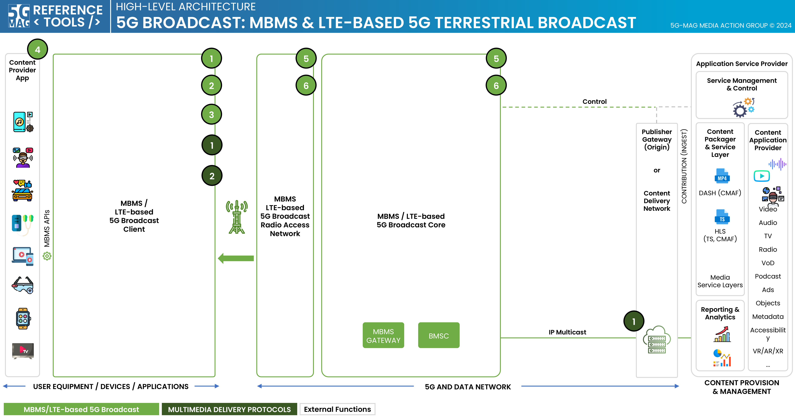
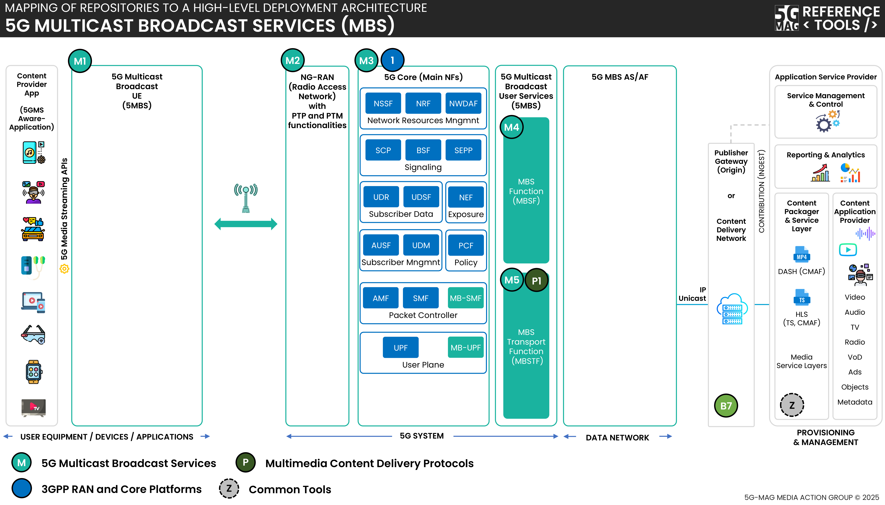

 

[Scope](./scope.html){: .btn .btn-blue } [Project Roadmap](./projects.html){: .btn .btn-blue } [GitHub Repos](./repositories.html){: .btn .btn-github } [Releases](./repositories.html#latest-releases){: .btn .btn-release } [Tutorials](./tutorials.html){: .btn .btn-tutorial } [Video Library](./tutorials.html#video-library){: .btn .btn-video } [Requirements](./requirements.html){: .btn .btn-blue }

# Scope

This page contains information such as the specifications within the scope of the tools and high-level architectures that bring context to their applicability.

Technical documentation providing context to this project can be found in the link below.

[Tech: 5G Broadcast: TV, Radio and Emergency Alerts](https://hub.5g-mag.com/Tech/pages/5gbroadcast.html){: .btn .btn-blue }

[Tech: Multicast and Broadcast Services in 5G Networks](https://jordijoangimenez.github.io/Tech/pages/multicastbroadcast.html){: .btn .btn-blue }

A list of relevant specifications can be found in the link below.

[Standards: Multimedia Delivery Protocols](https://hub.5g-mag.com/Standards/pages/multimedia-content-delivery.html){: .btn .btn-blue }

# High-level architectures

## 5G Broadcast with Multimedia delivery protocols

[5G Broadcast: Repositories](../lte-based-5g-broadcast/repositories.html){: .btn .btn-5gbc }
[Multimedia content delivery protocols: Repositories](../multimedia-content-delivery/repositories.html){: .btn .btn-md }
[Common Tools: Repositories](../common-tools/){: .btn .btn-common }

## 5G Multicast Broadcast Services (MBS) with Multimedia delivery protocols

[5G Multicast Broadcast Services: Repositories](../5g-multicast-broadcast-services/repositories.html){: .btn .btn-5mbs }
[Multimedia content delivery protocols: Repositories](../multimedia-content-delivery/repositories.html){: .btn .btn-md }
[3GPP RAN and Core Platforms: Repositories](../3gpp-ran-and-core-platforms/repositories.html){: .btn .btn-3gpp }
[Common Tools: Repositories](../common-tools/){: .btn .btn-common }
