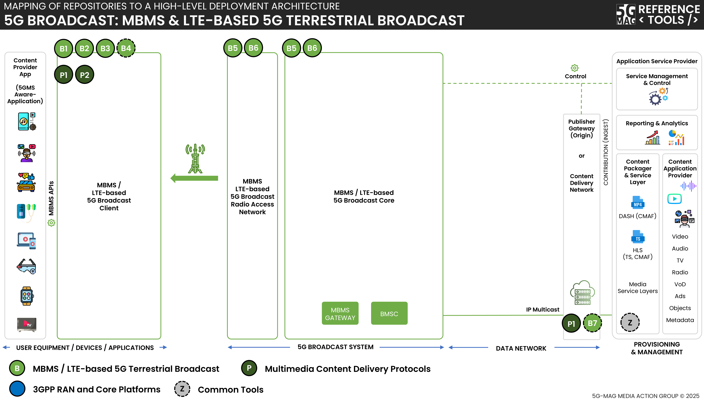

 

1. TOC
{:toc}

This page contains information such as the specifications within the scope of the tools, high-level architecture, APIs under implementation,...

# Specifications
Visit the [Standards repository](https://5g-mag.github.io/Standards/pages/data-collection-event-exposure.html) for more details on the specifications within the scope of the tools.

# High-level architecture

## High-level architecture: 5G Broadcast with Multimedia delivery protocols

 * Check [here](./repositories.html) to access the repositories for Multimedia delivery protocols
 * Check [here](../lte-based-5g-broadcast/repositories.html) to access the repositories for 5G Broadcast
