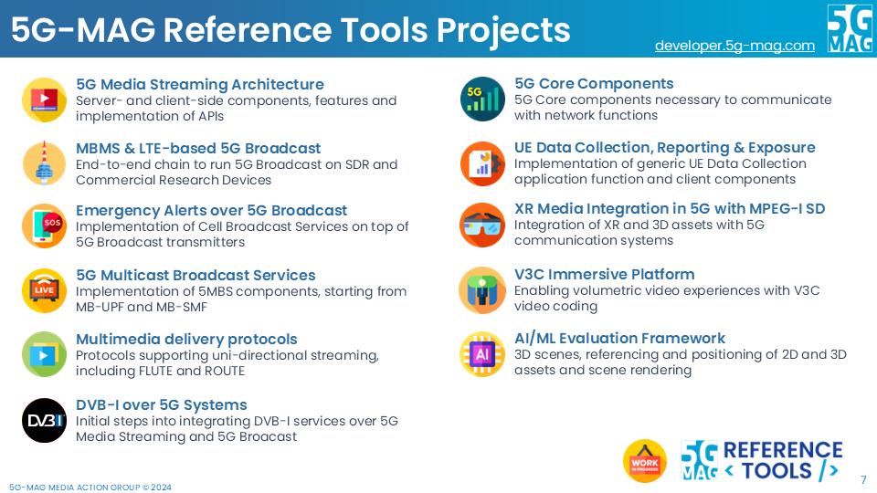

# Overview of 5G-MAG Reference Tools

<iframe width="60%" height="520" src="https://drive.google.com/file/d/1tPcMWLeY6QJNH5OfGWDwLmoSyjrqk8gA/preview"></iframe>

[DOWNLOAD THE PRESENTATION](https://drive.google.com/file/d/1tPcMWLeY6QJNH5OfGWDwLmoSyjrqk8gA/preview){: .btn}

---

# The Projects

---

 

## Project: 5G Media Streaming Architecture
* Check the [**Roadmap**](https://github.com/orgs/5G-MAG/projects/44/views/9)
* **Reference Tools** available:
   * [**Project: 5G Media Streaming Architecture**](https://5g-mag.github.io/Getting-Started/pages/5g-media-streaming/)
   * [**Project: 5G Core Network components**](https://5g-mag.github.io/Getting-Started/pages/5g-core-network-components/)

---

 

## Project: UE Data Collection, Reporting & Event Exposure
* Check the [**Roadmap**](https://github.com/orgs/5G-MAG/projects/44/views/21)
* **Reference Tools** available:
   * [**Project: UE data collection, reporting and event exposure**](https://5g-mag.github.io/Getting-Started/pages/ue-data-collection-reporting-exposure/)

---

 

## Project: 5G Broadcast
* Check the [**Roadmap**](https://github.com/orgs/5G-MAG/projects/44/views/10)
* **Reference Tools** available:
    * [**Project: 5G Broadcast Hybrid Services**](https://5g-mag.github.io/Getting-Started/pages/lte-based-5g-broadcast/)
    * [**Project: Emergency Alerts over 5G Broadcast**](https://5g-mag.github.io/Getting-Started/pages/emergency-alerts/)

---

 

## Project: 5G Multicast Broadcast Services
* Check the [**Roadmap**](https://github.com/orgs/5G-MAG/projects/44/views/7)
* **Reference Tools** available:
    * [**Project: 5G Multicast Broadcast Services**](https://5g-mag.github.io/Getting-Started/pages/5g-multicast-broadcast-services/)

---

 

## Project: XR Media with MPEG-I Scene Description
* Check the [**Roadmap**](https://github.com/orgs/5G-MAG/projects/44/views/13)
* **Reference Tools** available:
   * [**Project: XR Media with MPEG-I Scene Description**](https://5g-mag.github.io/Getting-Started/pages/xr-media-integration-in-5g/)

---

 

## Project: Volumetric Video Experiences with MPEG V3C
* Check the [**Roadmap**](https://github.com/orgs/5G-MAG/projects/44/views/18)
* **Reference Tools** available:
   * [**Project: V3C Immersive Platform**](https://5g-mag.github.io/Getting-Started/pages/v3c-immersive-platform/)

---

 

## Project: Beyond 2D Video Experiences
* Check the [**Roadmap**](https://github.com/orgs/5G-MAG/projects/44/views/15)
* **Reference Tools** available:
   * [**Project: Beyond 2D Evaluation Framework**](https://5g-mag.github.io/Getting-Started/pages/beyond-2d-evaluation-framework/)

---

 

## Project: AI/ML in Mobile Media Services
* Check the [**Roadmap**](https://github.com/orgs/5G-MAG/projects/44/views/16)
* **Reference Tools** available:
   * [**Project: AI & ML Evaluation Framework**](https://5g-mag.github.io/Getting-Started/pages/ai-ml-evaluation-framework/)

---

 

## Project: Multimedia Content Delivery Protocols
* Check the [**Roadmap**](https://github.com/orgs/5G-MAG/projects/44/views/22)
* **Reference Tools** available:
   * [**Project: Multimedia Content Delivery Protocols**](https://5g-mag.github.io/Getting-Started/pages/multimedia-content-delivery/)

---

 

## Project: DVB-I Services over 5G Systems
* Check the [**Roadmap**](https://github.com/orgs/5G-MAG/projects/44/views/17)
* **Reference Tools** available:
   * [**Project: DVB-I Services over 5G Systems**](https://5g-mag.github.io/Getting-Started/pages/dvbi-over-5g/)

---

{: .note }
Copyright: 5G Media Action Group (5G-MAG)
Please refer to the [Tech](https://github.com/5G-MAG/Tech/tree/main/pages) repository to provide updates to this documentation.
