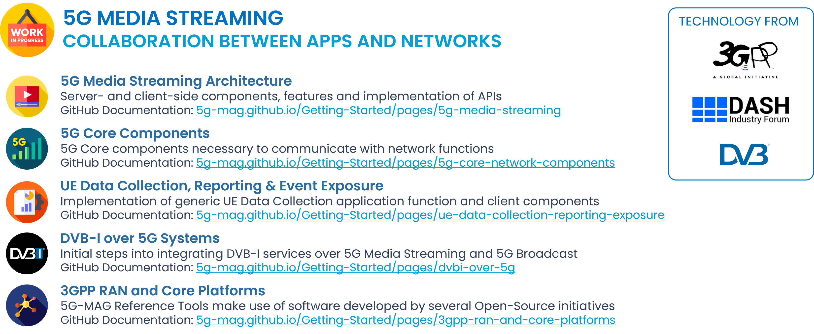
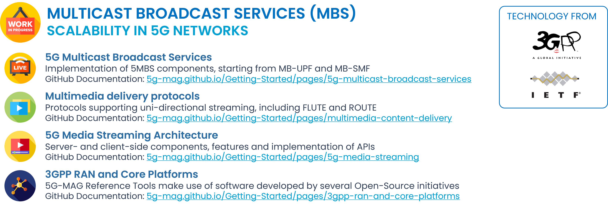
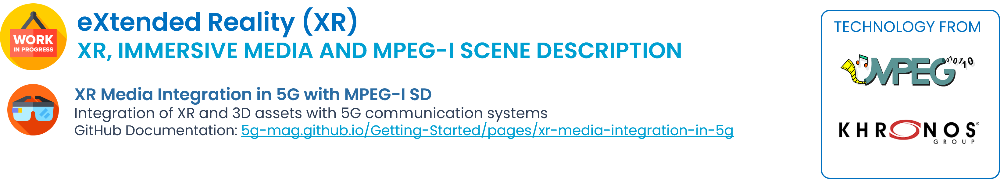
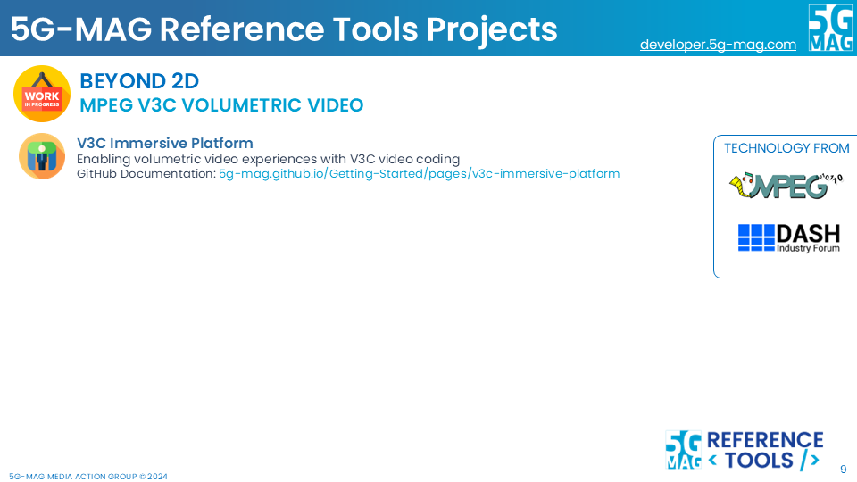
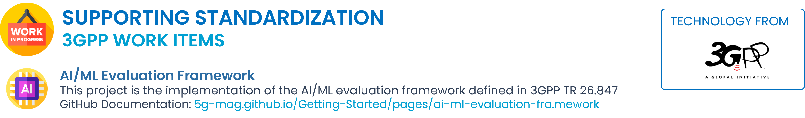

# Overview of Reference Tools

## 5G-MAG Reference Tools for "5G Media Streaming"

### 5G Downlink Media Streaming
* [Details of the project](./5g-media-streaming/)

### 5G Core Network Components
* [Details of the project](./5g-core-network-components/)

### UE Data Collection, Reporting and Event Exposure
* [Details of the project](./ue-data-collection-reporting-exposure/)

### DVB-I Services over 5G
* [Details of the project](./dvbi-over-5g/)

### 3GPP RAN and Core Platforms
* [Details of the project](./3gpp-ran-and-core-platforms/)

---

## 5G-MAG Reference Tools for "5G Broadcast"

### MBMS and LTE-based 5G Broadcast
* [Details of the project](./lte-based-5g-broadcast/)

### Emergency Alerts over 5G Broadcast
* [Details of the project](./emergency-alerts/)

### Multimedia content delivery protocols
* [Details of the project](./multimedia-content-delivery/)

### 5G Downlink Media Streaming
* [Details of the project](./5g-media-streaming/)

### DVB-I Services over 5G
* [Details of the project](./dvbi-over-5g/)

### 3GPP RAN and Core Platforms
* [Details of the project](./3gpp-ran-and-core-platforms/)

---

## 5G-MAG Reference Tools for "5G Multicast Broadcast Services (MBS)"

### 5G Multicast and Broadcast Services (5MBS)
* [Details of the project](./5g-multicast-broadcast-services/)

### Multimedia content delivery protocols
* [Details of the project](./multimedia-content-delivery/)

### 5G Downlink Media Streaming
* [Details of the project](./5g-media-streaming/)

### 3GPP RAN and Core Platforms
* [Details of the project](./3gpp-ran-and-core-platforms/)

---

## 5G-MAG Reference Tools for "eXtended Reality (XR)"

### XR Media integration in 5G
* [Details of the project](./xr-media-integration-in-5g/)

---

## 5G-MAG Reference Tools for "Beyond 2D"

### V3C Immersive Platform
* [Details of the project](./v3c-immersive-platform/)

---

## 5G-MAG Reference Tools supporting standardization

### Artificial Intelligence and Machine Learning Evaluation Framework
* [Details of the project](./ai-ml-evaluation-framework/)
