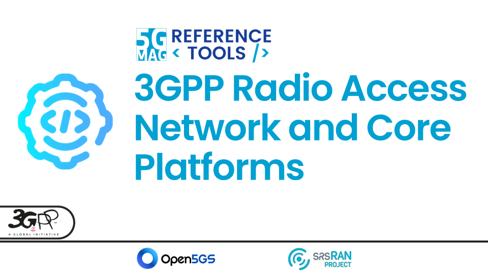

 

# All the 5G-MAG Reference Tools Projects (A-Z)

<table>
  <tr>
    <td markdown="span" align="center"><a href="./3gpp-ran-and-core-platforms/"><a/></td>
    <td markdown="span" align="center"><a href="./lte-based-5g-broadcast/"><a/></td>
  </tr>
  <tr>
    <td markdown="span" align="center">[Project Documentation](./3gpp-ran-and-core-platforms/){: .btn .btn-blue } </td>
    <td markdown="span" align="center">[Project Documentation](./lte-based-5g-broadcast/){: .btn .btn-blue } [Project Roadmap](https://github.com/orgs/5G-MAG/projects/48/views/7){: .btn .btn-blue } [Latest Releases](./releases.html#project-5g-broadcast-tv-and-radio-hybrid-services){: .btn .btn-blue } </td>
  </tr>
    <td> </td>
  <tr>
    <td markdown="span" align="center"><a href="./emergency-alerts/"><a/></td>
    <td markdown="span" align="center"><a href="./5g-media-streaming/"><a/></td>
 </tr>
  <tr>
    <td markdown="span" align="center">[Project Documentation](./emergency-alerts/){: .btn .btn-blue } [Project Roadmap](https://github.com/orgs/5G-MAG/projects/48/views/12){: .btn .btn-blue } [Latest Releases](./releases.html#project-5g-broadcast-emergency-alerts){: .btn .btn-blue } </td>
    <td markdown="span" align="center">[Project Documentation](./5g-media-streaming/){: .btn .btn-blue } [Project Roadmap](https://github.com/orgs/5G-MAG/projects/48/views/6){: .btn .btn-blue } [Latest Releases](./releases.html#project-5g-media-streaming){: .btn .btn-blue } </td>
  </tr>
    <td> </td>
  <tr>
    <td markdown="span" align="center"><a href="./5g-multicast-broadcast-services/"><a/></td>
    <td markdown="span" align="center"><a href="./5g-core-service-consumers/"><a/></td>
  </tr>
  <tr>
    <td markdown="span" align="center">[Project Documentation](./5g-multicast-broadcast-services/){: .btn .btn-blue } [Project Roadmap](https://github.com/orgs/5G-MAG/projects/48/views/13){: .btn .btn-blue } [Latest Releases](./releases.html#project-5g-multicast-broadcast-services){: .btn .btn-blue } </td>
    <td markdown="span" align="center">[Project Documentation](./5g-core-service-consumers/){: .btn .btn-blue } [Project Roadmap](https://github.com/orgs/5G-MAG/projects/48/views/17){: .btn .btn-blue } [Latest Releases](./releases.html#project-5g-core-service-consumers){: .btn .btn-blue } </td>
  </tr>
    <td> </td>
  <tr>
    <td markdown="span" align="center"><a href="./6g-testbed-ai-traffic/"><a/></td>
    <td markdown="span" align="center"><a href="./ai-ml-evaluation-framework/"><a/></td>
  </tr>
  <tr>
    <td markdown="span" align="center">[Project Documentation](./6g-testbed-ai-traffic/){: .btn .btn-blue } [Project Roadmap](https://github.com/orgs/5G-MAG/projects/48/views/yy){: .btn .btn-blue } [Latest Releases](./releases.html#project-6g-testbed-ai-traffic){: .btn .btn-blue } </td>
    <td markdown="span" align="center">[Project Documentation](./ai-ml-evaluation-framework/){: .btn .btn-blue } [Project Roadmap](https://github.com/orgs/5G-MAG/projects/48/views/9){: .btn .btn-blue } [Latest Releases](./releases.html#project-aiml-in-mobile-media-services){: .btn .btn-blue } </td>
  </tr>
    <td> </td>
  <tr>
    <td markdown="span" align="center"><a href="./avatar-communications/"><a/></td>
    <td markdown="span" align="center"><a href="./beyond-2d-evaluation-framework/"><a/></td>
  </tr>
  <tr>
    <td markdown="span" align="center">[Project Documentation](./avatar-communications/){: .btn .btn-blue } [Project Roadmap](https://github.com/orgs/5G-MAG/projects/48/views/xx){: .btn .btn-blue } [Latest Releases](./releases.html#project-avatar-communications){: .btn .btn-blue } </td>
    <td markdown="span" align="center">[Project Documentation](./beyond-2d-evaluation-framework/){: .btn .btn-blue } [Project Roadmap](https://github.com/orgs/5G-MAG/projects/48/views/10){: .btn .btn-blue } [Latest Releases](./releases.html#project-beyond-2d-video-experiences){: .btn .btn-blue } </td>
  </tr>
    <td> </td>
  <tr>
    <td markdown="span" align="center"><a href="./dvbi-over-5g/"><a/></td>
    <td markdown="span" align="center"><a href="./multimedia-content-delivery/"><a/></td>  
  </tr>
  <tr>
    <td markdown="span" align="center">[Project Documentation](./dvbi-over-5g/){: .btn .btn-blue } [Project Roadmap](https://github.com/orgs/5G-MAG/projects/48/views/11){: .btn .btn-blue } [Latest Releases](./releases.html#project-dvb-i-services-over-5g-systems){: .btn .btn-blue } </td>
    <td markdown="span" align="center">[Project Documentation](./multimedia-content-delivery/){: .btn .btn-blue } [Project Roadmap](https://github.com/orgs/5G-MAG/projects/48/views/14){: .btn .btn-blue } [Latest Releases](./releases.html#project-multimedia-content-delivery-protocols){: .btn .btn-blue } </td>
  </tr>
    <td> </td>
  <tr>
    <td markdown="span" align="center"><a href="./v3c-immersive-platform/"><a/></td>
    <td markdown="span" align="center"><a href="./ue-data-collection-reporting-exposure/"><a/></td>
  </tr>
  <tr>
    <td markdown="span" align="center">[Project Documentation](./v3c-immersive-platform/){: .btn .btn-blue } [Project Roadmap](https://github.com/orgs/5G-MAG/projects/48/views/15){: .btn .btn-blue } [Latest Releases](./releases.html#project-volumetric-video-experiences-with-mpeg-v3c){: .btn .btn-blue } </td>
    <td markdown="span" align="center">[Project Documentation](./ue-data-collection-reporting-exposure/){: .btn .btn-blue } [Project Roadmap](https://github.com/orgs/5G-MAG/projects/48/views/8){: .btn .btn-blue } [Latest Releases](./releases.html#project-ue-data-collection-reporting--event-exposure){: .btn .btn-blue } </td>
  </tr>
    <td> </td>
  <tr>
    <td markdown="span" align="center"><a href="./xr-media-integration-in-5g/"><a/></td>
    <td markdown="span" align="center"><a href="./xr-media-integration-in-5g/"><a/></td>
  </tr>
  <tr>
    <td markdown="span" align="center">[Project Documentation](./xr-media-integration-in-5g/){: .btn .btn-blue } [Project Roadmap](https://github.com/orgs/5G-MAG/projects/48/views/16){: .btn .btn-blue } [Latest Releases](./releases.html#project-xr-media-with-mpeg-i-scene-description){: .btn .btn-blue } </td>
    <td markdown="span" align="center">[Project Documentation](./xr-media-integration-in-5g/){: .btn .btn-blue } [Project Roadmap](https://github.com/orgs/5G-MAG/projects/48/views/16){: .btn .btn-blue } [Latest Releases](./releases.html#project-xr-media-with-mpeg-i-scene-description){: .btn .btn-blue } </td>
  </tr>
</table>

## Other Tools

### Auxiliary tools common to various projects
[Documentation](./common-tools/index.html){: .btn .btn-blue }
[Latest Releases](./releases.html#auxiliary-tools-common-to-various-projects){: .btn .btn-blue }

### External Tools
[Documentation](./external-tools/index.html){: .btn .btn-blue }
