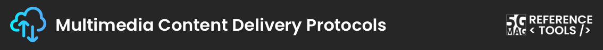
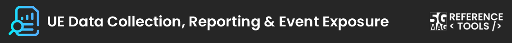

 

# Reference Tools Projects: Open Pull Requests

> **Last Synced:** {{ site.data.pull_requests.last_updated }}

---

 

## Open PRs - 5G Broadcast: TV and Radio Hybrid Services
[Project Documentation](./lte-based-5g-broadcast/){: .btn .btn-blue }

<table class="release-table">
  <thead>
    <tr>
      <th style="width: 25%;">Repository</th>
      <th style="width: 45%;">Pull Request</th>
      <th style="width: 15%;">Author</th>
      <th style="width: 15%;">Date</th>
    </tr>
  </thead>
  <tbody>
    
    
      
      <tr>
        <td><a href="https://github.com/5G-MAG/{{ item.repo }}" class="btn">{{ item.repo }}</a></td>
        <td><a href="{{ item.url }}" class="btn">{{ item.title }}</a></td>
        <td>@{{ item.user }}</td>
        <td class="date-cell">
          {{ item.date }} 
          ({{ item.days_ago }} days ago)
        </td>
      </tr>
      
    
      <tr><td colspan="4" class="no-prs">No open pull requests</td></tr>
    
  </tbody>
</table>

---

 

## Open PRs - 5G Broadcast: Emergency Alerts
[Project Documentation](./emergency-alerts/){: .btn .btn-blue }

<table class="release-table">
  <thead>
    <tr>
      <th style="width: 25%;">Repository</th>
      <th style="width: 45%;">Pull Request</th>
      <th style="width: 15%;">Author</th>
      <th style="width: 15%;">Date</th>
    </tr>
  </thead>
  <tbody>
    
    
      
      <tr>
        <td><a href="https://github.com/5G-MAG/{{ item.repo }}" class="btn">{{ item.repo }}</a></td>
        <td><a href="{{ item.url }}" class="btn">{{ item.title }}</a></td>
        <td>@{{ item.user }}</td>
        <td class="date-cell">
          {{ item.date }} 
          ({{ item.days_ago }} days ago)
        </td>
      </tr>
      
    
      <tr><td colspan="4" class="no-prs">No open pull requests</td></tr>
    
  </tbody>
</table>

---

 

## Open PRs - 5G Media Streaming
[Project Documentation](./5g-media-streaming/){: .btn .btn-blue }

<table class="release-table">
  <thead>
    <tr>
      <th style="width: 25%;">Repository</th>
      <th style="width: 45%;">Pull Request</th>
      <th style="width: 15%;">Author</th>
      <th style="width: 15%;">Date</th>
    </tr>
  </thead>
  <tbody>
    
    
      
      <tr>
        <td><a href="https://github.com/5G-MAG/{{ item.repo }}" class="btn">{{ item.repo }}</a></td>
        <td><a href="{{ item.url }}" class="btn">{{ item.title }}</a></td>
        <td>@{{ item.user }}</td>
        <td class="date-cell">
          {{ item.date }} 
          ({{ item.days_ago }} days ago)
        </td>
      </tr>
      
    
      <tr><td colspan="4" class="no-prs">No open pull requests</td></tr>
    
  </tbody>
</table>

---

 

## Open PRs - 5G Multicast Broadcast Services
[Project Documentation](./5g-multicast-broadcast-services/){: .btn .btn-blue }

<table class="release-table">
  <thead>
    <tr>
      <th style="width: 25%;">Repository</th>
      <th style="width: 45%;">Pull Request</th>
      <th style="width: 15%;">Author</th>
      <th style="width: 15%;">Date</th>
    </tr>
  </thead>
  <tbody>
    
    
      
      <tr>
        <td><a href="https://github.com/5G-MAG/{{ item.repo }}" class="btn">{{ item.repo }}</a></td>
        <td><a href="{{ item.url }}" class="btn">{{ item.title }}</a></td>
        <td>@{{ item.user }}</td>
        <td class="date-cell">
          {{ item.date }} 
          ({{ item.days_ago }} days ago)
        </td>
      </tr>
      
    
      <tr><td colspan="4" class="no-prs">No open pull requests</td></tr>
    
  </tbody>
</table>

---

 

## Open PRs - 5GC Service Consumers
[Project Documentation](./5g-core-service-consumers/){: .btn .btn-blue }

<table class="release-table">
  <thead>
    <tr>
      <th style="width: 25%;">Repository</th>
      <th style="width: 45%;">Pull Request</th>
      <th style="width: 15%;">Author</th>
      <th style="width: 15%;">Date</th>
    </tr>
  </thead>
  <tbody>
    
    
      
      <tr>
        <td><a href="https://github.com/5G-MAG/{{ item.repo }}" class="btn">{{ item.repo }}</a></td>
        <td><a href="{{ item.url }}" class="btn">{{ item.title }}</a></td>
        <td>@{{ item.user }}</td>
        <td class="date-cell">
          {{ item.date }} 
          ({{ item.days_ago }} days ago)
        </td>
      </tr>
      
    
      <tr><td colspan="4" class="no-prs">No open pull requests</td></tr>
    
  </tbody>
</table>

---

 

## Open PRs - 6G Testbed and AI Traffic Characterization
[Project Documentation](./6g-testbed-ai-traffic/){: .btn .btn-blue }

<table class="release-table">
  <thead>
    <tr>
      <th style="width: 25%;">Repository</th>
      <th style="width: 45%;">Pull Request</th>
      <th style="width: 15%;">Author</th>
      <th style="width: 15%;">Date</th>
    </tr>
  </thead>
  <tbody>
    
    
      
      <tr>
        <td><a href="https://github.com/5G-MAG/{{ item.repo }}" class="btn">{{ item.repo }}</a></td>
        <td><a href="{{ item.url }}" class="btn">{{ item.title }}</a></td>
        <td>@{{ item.user }}</td>
        <td class="date-cell">
          {{ item.date }} 
          ({{ item.days_ago }} days ago)
        </td>
      </tr>
      
    
      <tr><td colspan="4" class="no-prs">No open pull requests</td></tr>
    
  </tbody>
</table>

---

 

## Open PRs - AI/ML in Mobile Media Services
[Project Documentation](./ai-ml-evaluation-framework/){: .btn .btn-blue }

<table class="release-table">
  <thead>
    <tr>
      <th style="width: 25%;">Repository</th>
      <th style="width: 45%;">Pull Request</th>
      <th style="width: 15%;">Author</th>
      <th style="width: 15%;">Date</th>
    </tr>
  </thead>
  <tbody>
    
    
      
      <tr>
        <td><a href="https://github.com/5G-MAG/{{ item.repo }}" class="btn">{{ item.repo }}</a></td>
        <td><a href="{{ item.url }}" class="btn">{{ item.title }}</a></td>
        <td>@{{ item.user }}</td>
        <td class="date-cell">
          {{ item.date }} 
          ({{ item.days_ago }} days ago)
        </td>
      </tr>
      
    
      <tr><td colspan="4" class="no-prs">No open pull requests</td></tr>
    
  </tbody>
</table>

---

 

## Open PRs - Beyond 2D Video Experiences
[Project Documentation](./beyond-2d-evaluation-framework/){: .btn .btn-blue }

<table class="release-table">
  <thead>
    <tr>
      <th style="width: 25%;">Repository</th>
      <th style="width: 45%;">Pull Request</th>
      <th style="width: 15%;">Author</th>
      <th style="width: 15%;">Date</th>
    </tr>
  </thead>
  <tbody>
    
    
      
      <tr>
        <td><a href="https://github.com/5G-MAG/{{ item.repo }}" class="btn">{{ item.repo }}</a></td>
        <td><a href="{{ item.url }}" class="btn">{{ item.title }}</a></td>
        <td>@{{ item.user }}</td>
        <td class="date-cell">
          {{ item.date }} 
          ({{ item.days_ago }} days ago)
        </td>
      </tr>
      
    
      <tr><td colspan="4" class="no-prs">No open pull requests</td></tr>
    
  </tbody>
</table>

---

 

## Open PRs - Conversational Avatar Real-Time Communications
[Project Documentation](./conversational-avatar/){: .btn .btn-blue }

<table class="release-table">
  <thead>
    <tr>
      <th style="width: 25%;">Repository</th>
      <th style="width: 45%;">Pull Request</th>
      <th style="width: 15%;">Author</th>
      <th style="width: 15%;">Date</th>
    </tr>
  </thead>
  <tbody>
    
    
      
      <tr>
        <td><a href="https://github.com/5G-MAG/{{ item.repo }}" class="btn">{{ item.repo }}</a></td>
        <td><a href="{{ item.url }}" class="btn">{{ item.title }}</a></td>
        <td>@{{ item.user }}</td>
        <td class="date-cell">
          {{ item.date }} 
          ({{ item.days_ago }} days ago)
        </td>
      </tr>
      
    
      <tr><td colspan="4" class="no-prs">No open pull requests</td></tr>
    
  </tbody>
</table>

---

 

## Open PRs - DVB-I over 5G Systems
[Project Documentation](./dvbi-over-5g/){: .btn .btn-blue }

<table class="release-table">
  <thead>
    <tr>
      <th style="width: 25%;">Repository</th>
      <th style="width: 45%;">Pull Request</th>
      <th style="width: 15%;">Author</th>
      <th style="width: 15%;">Date</th>
    </tr>
  </thead>
  <tbody>
    
    
      
      <tr>
        <td><a href="https://github.com/5G-MAG/{{ item.repo }}" class="btn">{{ item.repo }}</a></td>
        <td><a href="{{ item.url }}" class="btn">{{ item.title }}</a></td>
        <td>@{{ item.user }}</td>
        <td class="date-cell">
          {{ item.date }} 
          ({{ item.days_ago }} days ago)
        </td>
      </tr>
      
    
      <tr><td colspan="4" class="no-prs">No open pull requests</td></tr>
    
  </tbody>
</table>

---

 

## Open PRs - Multimedia Content Delivery Protocols
[Project Documentation](./multimedia-content-delivery/){: .btn .btn-blue }

<table class="release-table">
  <thead>
    <tr>
      <th style="width: 25%;">Repository</th>
      <th style="width: 45%;">Pull Request</th>
      <th style="width: 15%;">Author</th>
      <th style="width: 15%;">Date</th>
    </tr>
  </thead>
  <tbody>
    
    
      
      <tr>
        <td><a href="https://github.com/5G-MAG/{{ item.repo }}" class="btn">{{ item.repo }}</a></td>
        <td><a href="{{ item.url }}" class="btn">{{ item.title }}</a></td>
        <td>@{{ item.user }}</td>
        <td class="date-cell">
          {{ item.date }} 
          ({{ item.days_ago }} days ago)
        </td>
      </tr>
      
    
      <tr><td colspan="4" class="no-prs">No open pull requests</td></tr>
    
  </tbody>
</table>

---

 

## Open PRs - UE Data Collection, Reporting & Event Exposure
[Project Documentation](./ue-data-collection-reporting-exposure/){: .btn .btn-blue }

<table class="release-table">
  <thead>
    <tr>
      <th style="width: 25%;">Repository</th>
      <th style="width: 45%;">Pull Request</th>
      <th style="width: 15%;">Author</th>
      <th style="width: 15%;">Date</th>
    </tr>
  </thead>
  <tbody>
    
    
      
      <tr>
        <td><a href="https://github.com/5G-MAG/{{ item.repo }}" class="btn">{{ item.repo }}</a></td>
        <td><a href="{{ item.url }}" class="btn">{{ item.title }}</a></td>
        <td>@{{ item.user }}</td>
        <td class="date-cell">
          {{ item.date }} 
          ({{ item.days_ago }} days ago)
        </td>
      </tr>
      
    
      <tr><td colspan="4" class="no-prs">No open pull requests</td></tr>
    
  </tbody>
</table>

---

 

## Open PRs - V3C Immersive Platform
[Project Documentation](./v3c-immersive-platform/){: .btn .btn-blue }

<table class="release-table">
  <thead>
    <tr>
      <th style="width: 25%;">Repository</th>
      <th style="width: 45%;">Pull Request</th>
      <th style="width: 15%;">Author</th>
      <th style="width: 15%;">Date</th>
    </tr>
  </thead>
  <tbody>
    
    
      
      <tr>
        <td><a href="https://github.com/5G-MAG/{{ item.repo }}" class="btn">{{ item.repo }}</a></td>
        <td><a href="{{ item.url }}" class="btn">{{ item.title }}</a></td>
        <td>@{{ item.user }}</td>
        <td class="date-cell">
          {{ item.date }} 
          ({{ item.days_ago }} days ago)
        </td>
      </tr>
      
    
      <tr><td colspan="4" class="no-prs">No open pull requests</td></tr>
    
  </tbody>
</table>

---

 

## Open PRs - XR Media with MPEG-I Scene Description
[Project Documentation](./xr-media-integration-in-5g/){: .btn .btn-blue }

<table class="release-table">
  <thead>
    <tr>
      <th style="width: 25%;">Repository</th>
      <th style="width: 45%;">Pull Request</th>
      <th style="width: 15%;">Author</th>
      <th style="width: 15%;">Date</th>
    </tr>
  </thead>
  <tbody>
    
    
      
      <tr>
        <td><a href="https://github.com/5G-MAG/{{ item.repo }}" class="btn">{{ item.repo }}</a></td>
        <td><a href="{{ item.url }}" class="btn">{{ item.title }}</a></td>
        <td>@{{ item.user }}</td>
        <td class="date-cell">
          {{ item.date }} 
          ({{ item.days_ago }} days ago)
        </td>
      </tr>
      
    
      <tr><td colspan="4" class="no-prs">No open pull requests</td></tr>
    
  </tbody>
</table>

---

 

## Open PRs - Auxiliary tools common to various projects
[Documentation](./common-tools/index.html){: .btn .btn-blue }

<table class="release-table">
  <thead>
    <tr>
      <th style="width: 25%;">Repository</th>
      <th style="width: 45%;">Pull Request</th>
      <th style="width: 15%;">Author</th>
      <th style="width: 15%;">Date</th>
    </tr>
  </thead>
  <tbody>
    
    
      
      <tr>
        <td><a href="https://github.com/5G-MAG/{{ item.repo }}" class="btn">{{ item.repo }}</a></td>
        <td><a href="{{ item.url }}" class="btn">{{ item.title }}</a></td>
        <td>@{{ item.user }}</td>
        <td class="date-cell">
          {{ item.date }} 
          ({{ item.days_ago }} days ago)
        </td>
      </tr>
      
    
      <tr><td colspan="4" class="no-prs">No open pull requests</td></tr>
    
  </tbody>
</table>
