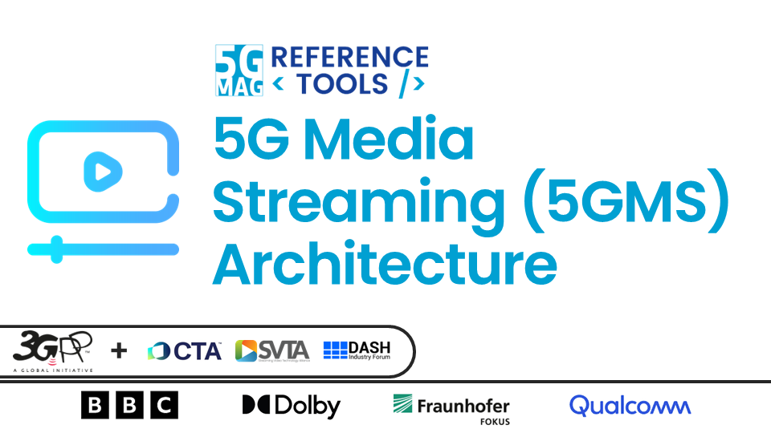
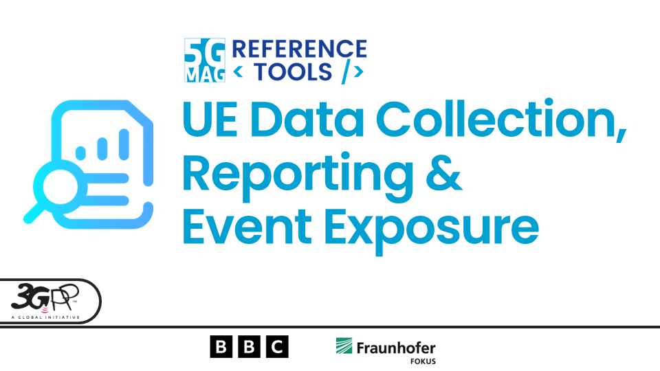
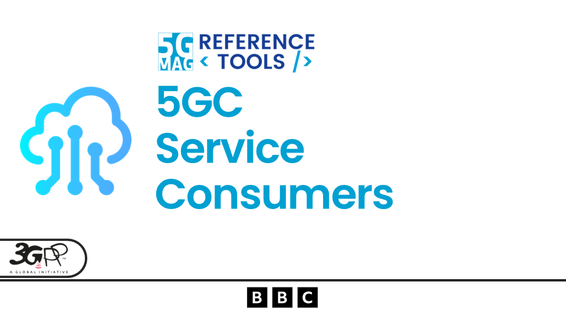
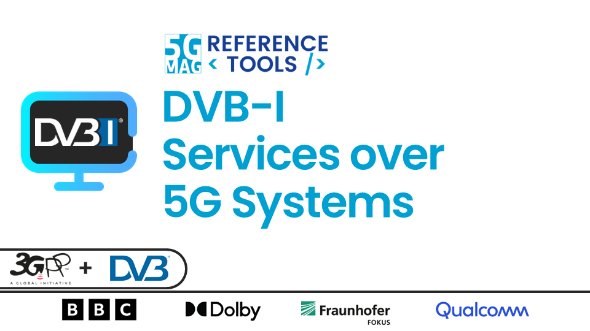

 

# Streaming, Media Delivery and Data Collection

<table>
  <tr>
    <td markdown="span" align="center"><a href="./5g-media-streaming/"><a/></td>
    <td markdown="span" align="center"><a href="./ue-data-collection-reporting-exposure/"><a/></td>
  </tr>
  <tr>
    <td markdown="span" align="center">[Project Documentation](./5g-media-streaming/){: .btn .btn-blue } [Project Roadmap](https://github.com/orgs/5G-MAG/projects/48/views/6){: .btn .btn-blue } [Latest Releases](./releases.html#project-5g-media-streaming){: .btn .btn-blue } </td>
    <td markdown="span" align="center">[Project Documentation](./ue-data-collection-reporting-exposure/){: .btn .btn-blue } [Project Roadmap](https://github.com/orgs/5G-MAG/projects/48/views/8){: .btn .btn-blue } [Latest Releases](./releases.html#project-ue-data-collection-reporting--event-exposure){: .btn .btn-blue } </td>
  </tr>
    <td> </td>
  <tr>
    <td markdown="span" align="center"><a href="./5g-core-service-consumers/"><a/></td>
    <td markdown="span" align="center"><a href="./dvbi-over-5g/"><a/></td>
  </tr>
  <tr>
    <td markdown="span" align="center">[Project Documentation](./5g-core-service-consumers/){: .btn .btn-blue } [Project Roadmap](https://github.com/orgs/5G-MAG/projects/48/views/17){: .btn .btn-blue } [Latest Releases](./releases.html#project-5g-core-service-consumers){: .btn .btn-blue } </td>
    <td markdown="span" align="center">[Project Documentation](./dvbi-over-5g/){: .btn .btn-blue } [Project Roadmap](https://github.com/orgs/5G-MAG/projects/48/views/11){: .btn .btn-blue } [Latest Releases](./releases.html#project-dvb-i-services-over-5g-systems){: .btn .btn-blue } </td>
  </tr>
</table>

---

## Other Tools

### Auxiliary tools common to various projects
[Documentation](./common-tools/index.html){: .btn .btn-blue }
[Latest Releases](./releases.html#auxiliary-tools-common-to-various-projects){: .btn .btn-blue }

### 3GPP RAN and Core Platforms
[Documentation](./3gpp-ran-and-core-platforms/index.html){: .btn .btn-blue }

### External Tools
[Documentation](./external-tools/index.html){: .btn .btn-blue }
