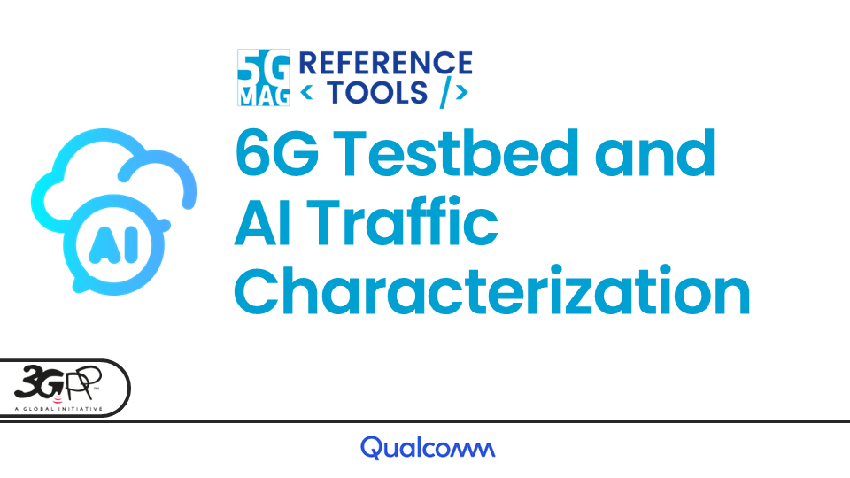
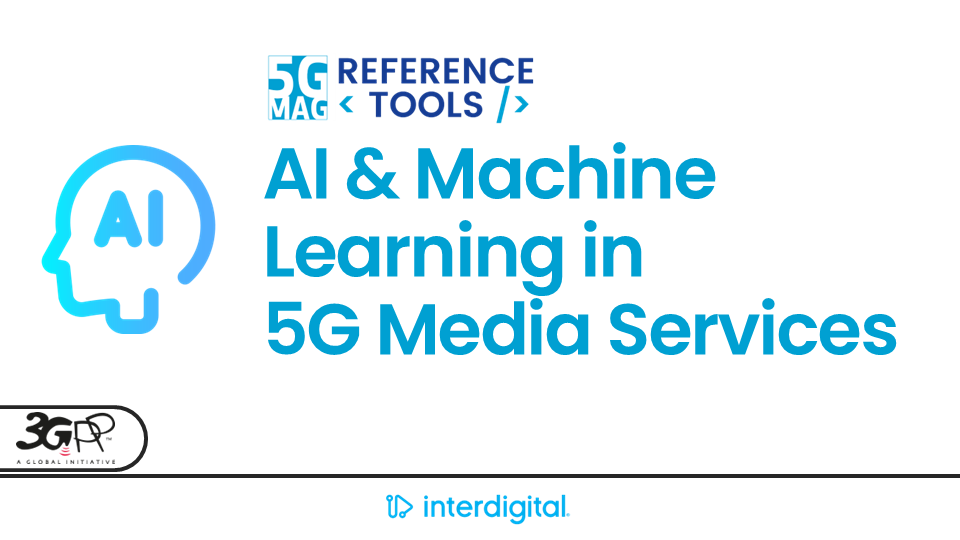

 

# Test-beds and Evaluation Frameworks

<table>
  <tr>
    <td markdown="span" align="center"><a href="./6g-testbed-ai-traffic/"><a/></td>
    <td markdown="span" align="center"><a href="./ai-ml-evaluation-framework/"><a/></td>
  </tr>
  <tr>
    <td markdown="span" align="center">[Project Documentation](./6g-testbed-ai-traffic/){: .btn .btn-blue } [Project Roadmap](https://github.com/orgs/5G-MAG/projects/48/views/yy){: .btn .btn-blue } [Latest Releases](./releases.html#project-6g-testbed-ai-traffic){: .btn .btn-blue } </td>
    <td markdown="span" align="center">[Project Documentation](./ai-ml-evaluation-framework/){: .btn .btn-blue } [Project Roadmap](https://github.com/orgs/5G-MAG/projects/48/views/9){: .btn .btn-blue } [Latest Releases](./releases.html#project-aiml-in-mobile-media-services){: .btn .btn-blue } </td>
  </tr>
</table>

## Other Tools

### Auxiliary tools common to various projects
[Documentation](./common-tools/index.html){: .btn .btn-blue }
[Latest Releases](./releases.html#auxiliary-tools-common-to-various-projects){: .btn .btn-blue }

### 3GPP RAN and Core Platforms
[Documentation](./3gpp-ran-and-core-platforms/index.html){: .btn .btn-blue }

### External Tools
[Documentation](./external-tools/index.html){: .btn .btn-blue }
