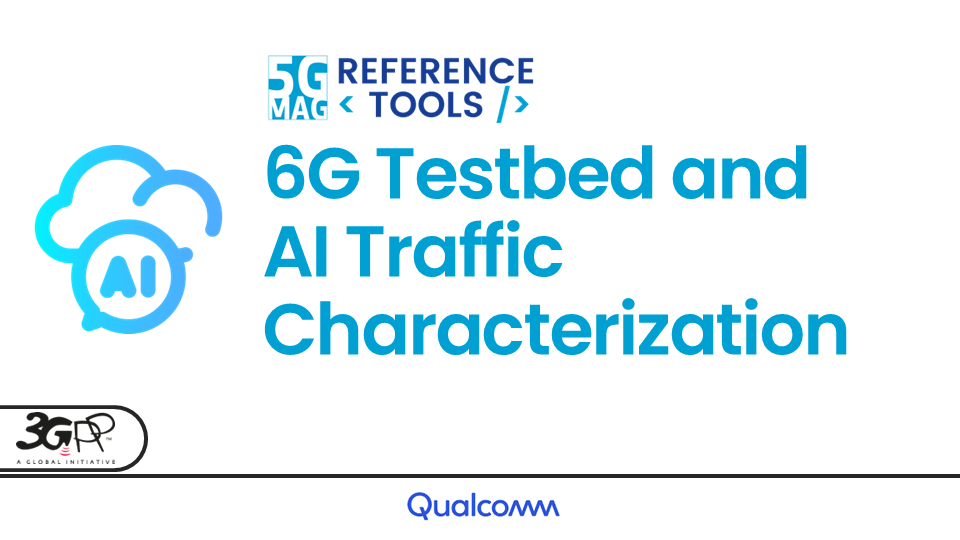
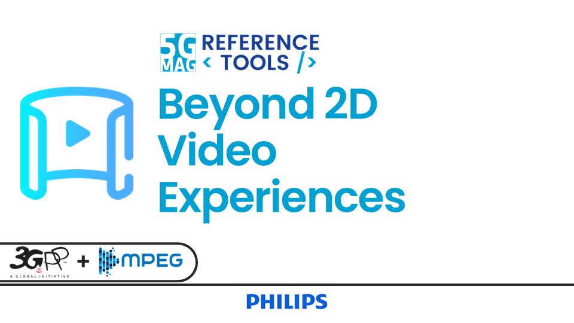

 

# Testbeds and Evaluation Frameworks

<table>
  <tr>
    <td markdown="span" align="center"><a href="./6g-testbed-ai-traffic/"><a/></td>
    <td markdown="span" align="center"><a href="./ai-ml-evaluation-framework/"><a/></td>
  </tr>
  <tr>
    <td markdown="span" align="center">[Project Documentation](./6g-testbed-ai-traffic/){: .btn .btn-blue } [Project Roadmap](https://github.com/orgs/5G-MAG/projects/48/views/yy){: .btn .btn-blue } [Latest Releases](./releases.html#latest-releases---6g-testbed-ai-traffic){: .btn .btn-blue } </td>
    <td markdown="span" align="center">[Project Documentation](./ai-ml-evaluation-framework/){: .btn .btn-blue } [Project Roadmap](https://github.com/orgs/5G-MAG/projects/48/views/9){: .btn .btn-blue } [Latest Releases](./releases.html#latest-releases---aiml-in-mobile-media-services){: .btn .btn-blue } </td>
  </tr>
    <td> </td>
  <tr>
    <td markdown="span" align="center"><a href="./beyond-2d-evaluation-framework/"><a/></td>
    <td markdown="span" align="center"><a href=""><a/></td>
  </tr>
  <tr>
    <td markdown="span" align="center">[Project Documentation](./beyond-2d-evaluation-framework/){: .btn .btn-blue } [Project Roadmap](https://github.com/orgs/5G-MAG/projects/48/views/10){: .btn .btn-blue } [Latest Releases](./releases.html#latest-releases---beyond-2d-video-experiences){: .btn .btn-blue } </td>
    <td markdown="span" align="center"></td>
  </tr>
</table>
