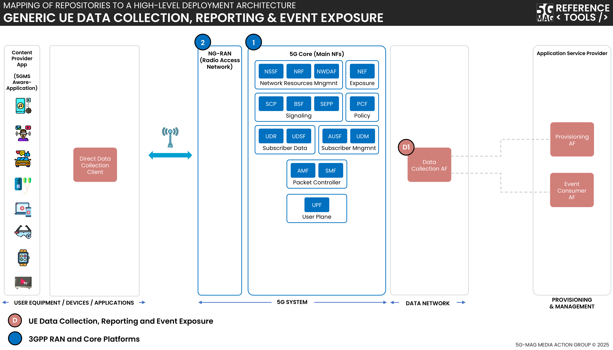
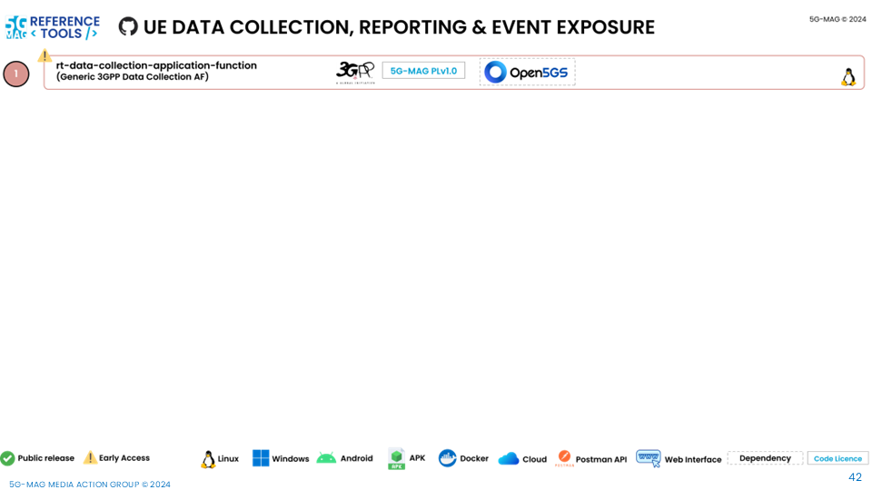

 

1. TOC
{:toc}

# High-level architecture

## Generic UE Data Collection, Reporting and Event Exposure

 * Check [here](../3gpp-ran-and-core-platforms/repositories.html) to access the repositories for 3GPP RAN and Core Platforms

## 5G Downlink Media Streaming (5GMSd) with UE Data Collection Reporting and Event Exposure

 * Check [here](../3gpp-ran-and-core-platforms/repositories.html) to access the repositories for 3GPP RAN and Core Platforms
 * Check [here](../5g-media-streaming/repositories.html) the repositories for 5G Downlink Media Streaming

# Repositories

---

## Data Collection Application Function: [rt-data-collection-application-function](https://github.com/5G-MAG/rt-data-collection-application-function)
