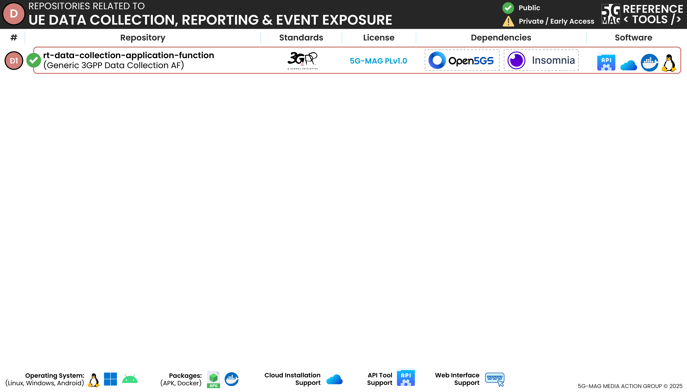

 

[Scope](./scope.html){: .btn .btn-blue } [Project Roadmap](./projects.html){: .btn .btn-blue } [GitHub Repos](./repositories.html){: .btn .btn-github } [Releases](../releases.html#project-ue-data-collection-reporting--event-exposure){: .btn .btn-release } [Tutorials](./tutorials.html){: .btn .btn-blue } [Requirements](./requirements.html){: .btn .btn-blue }

# Repositories

The following repositories are available. Please refer to the "Scope & Architecture" sections of the different projects for more context.

---

## Data Collection Application Function
[rt-data-collection-application-function](https://github.com/5G-MAG/rt-data-collection-application-function){: .btn .btn-uedc } [Releases](../releases.html#project-5g-multicast-broadcast-services){: .btn .btn-release }

This repository provides a 5G Data Collection Service Provider library and Application Function. The library is designed to be used by this stand alone Application Function or to be used as an embedded service within other Application Functions such as the 5GMS Application Function. The library can provide the interfaces designated as R1-R6 in the 3GPP TS 26.531 specification (See Clause 4.2). The default Application Function implementation here implements some of the data reports and events defined in 3GPP TS 26.531, 3GPP TS 26.532 and 3GPP TS 29.517.

Additional information:
* [Information and how to download, build, install and run](https://github.com/5G-MAG/rt-data-collection-application-function)
* [Releases](https://github.com/5G-MAG/rt-data-collection-application-function/releases)
* [Packages](https://github.com/orgs/5G-MAG/packages?repo_name=rt-data-collection-application-function)
* [Docker](https://github.com/5G-MAG/rt-data-collection-application-function/tree/main/docker)

---

# Packages

This project also provides or makes use of the following packages GitHub Container packages.

## UE Data Collection, Reporting and Event Exposure

Components | Package
 --|--
 DCAF | [https://github.com/5G-MAG/rt-data-collection-application-function/pkgs/container/data-collection-af](https://github.com/5G-MAG/rt-data-collection-application-function/pkgs/container/data-collection-af)
