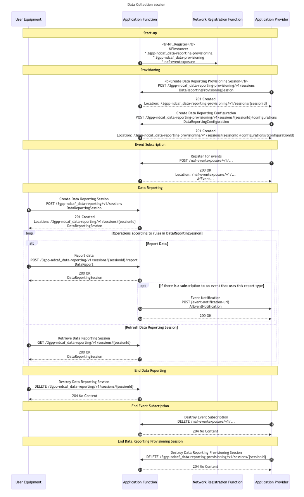
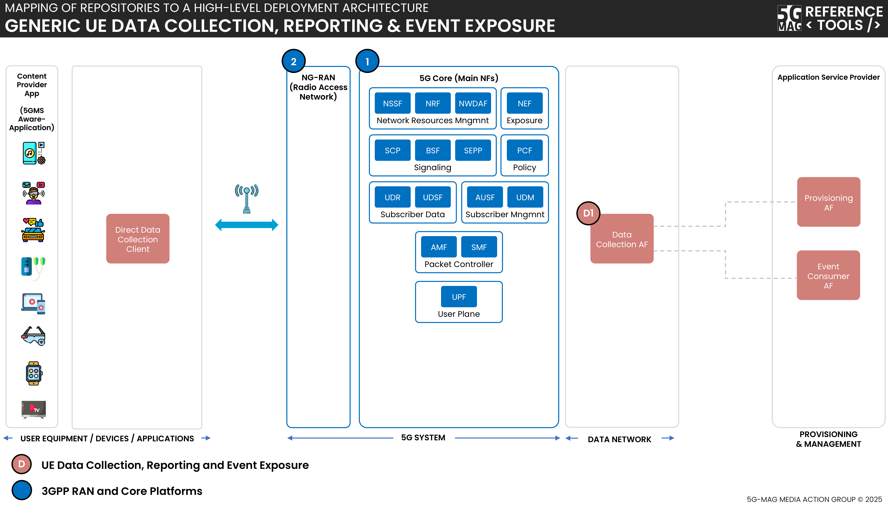

 

[Scope](./scope.html){: .btn .btn-blue } [Project Roadmap](./projects.html){: .btn .btn-blue } [GitHub Repos](./repositories.html){: .btn .btn-github } [Releases](../releases.html#project-ue-data-collection-reporting--event-exposure){: .btn .btn-release } [Tutorials](./tutorials.html){: .btn .btn-tutorial } [Requirements](./requirements.html){: .btn .btn-blue }

# Scope

In the context of 3GPP standards, 5G Media Streaming (5GMS) is defined as a framework designed to enable high-quality, efficient delivery of media. The architecture supports services from mobile network operators and third parties including both Downlink (5GMSd) and Uplink (5GMSu) Media Streaming. The 5GMS architecture is functionally divided into independent components enabling deployments with various degrees of integration between 5G MNOs and Content Providers.

A list of relevant specifications can be found in the link below.

[Specifications](https://hub.5g-mag.com/Standards/pages/data-collection-event-exposure.html){: .btn .btn-blue }

Technical documentation including explainers can be found in the link below.

[Technical Resources](https://hub.5g-mag.com/Tech/pages/data-collection-event-exposure.html){: .btn .btn-blue } 

# What is being implemented? 

{: .inshort }
A reusable Rel-18 DCAF Service Provider library for data reporting and event exposure. These functional entities could later on be integrated within the data reporting framework of 5G Media Streaming.

## Generic UE Data Collection, Reporting and Event Exposure

A functional Data Collection Application Function (DCAF) implementation is available with the building blocks highlighted with the green tick below.


The implementation involves the generic handling of provisioning, receipt and queueing of data reports, and event subscription management/exposure and service endpoints for provisioning (R1), data reporting (R2/R3/R4) and event subscription/exposure (R5/R6).

An illustrative usage sequence flow is shown below:



## R1 (Provisining API) - Ndcaf_DataReportingProvisioning

R1 supports interactions between a Provisioning AF (in the Application Service Provider) and the Data Collection AF to:
- Provision data collection and reporting in a Data Collection AF (by means of [Ndcaf_DataReportingProvisioning](https://jdegre.github.io/loader.html?yaml=TS26532_Ndcaf_DataReportingProvisioning.yaml) service.

### Creating a Data Reporting Provisioning Session
An example of a request body when Creating a new Data Reporting Provisioning Session is shown below:

```
{
  "provisioningSessionId": "string",
  "aspId": "string",
  "externalApplicationId": "string",
  "internalApplicationId": "string",
  "eventId": "UE_COMM",
  "dataReportingConfigurationIds": [
    "string"
  ]
}
```

Where UE_COMM is the example eventId which has been implemented (it indicated that the subscribed/notified event is UE communication information).

### Creating a Data Reporting Configuration
An example of a request body when Creating a new Data Reporting Configuration is shown below:

```
{
  "dataCollectionClientType": "DIRECT",
  "dataSamplingRules": [
    {
      "samplingPeriod": 10.0
    }
  ],
  "dataReportingRules": [
    {}
  ],
  "dataReportingConditions": [
    {
      "type": "INTERVAL",
      "period": 60
    }
  ],
  "dataAccessProfiles": [
    {
      "dataAccessProfileId": "per_min_totals",
      "targetEventConsumerTypes": [
        "NWDAF",
        "EVENT_CONSUMER_AF"
      ],
      "parameters": [],
      "timeAccessRestrictions": {
        "duration": 60,
        "aggregationFunctions": [
          "SUM"
        ]
      }
    }
  ]
}
```

## R6 (Event Exposure API) - Naf_EventExposure

R6 supports interactions between the Event Consumer AF (in the Application Service Provider) and the Data Collection AF to:
- Subscribe to data reporting events exposed by the Data Collection AF (by means of [Naf_EventExposure_Subscribe](https://jdegre.github.io/editor/?url=https://raw.githubusercontent.com/jdegre/5GC_APIs/Rel-17/TS29517_Naf_EventExposure.yaml) or Nnef_EventExposure_Subscribe services) - when used by an Event Consumer AF.
- To expose data reporting events to the Event Consumer AF (by means of [Naf_EventExposure_Notify](https://jdegre.github.io/editor/?url=https://raw.githubusercontent.com/jdegre/5GC_APIs/Rel-17/TS29517_Naf_EventExposure.yaml) or Nnef_EventExposure_Notify services) - when subsequently used by the Data Collection AF.

### Subscribing for Events
An example of a request body when Creating a new -individual Application Event Exposure Subscription is shown below:
```
{
  "eventsSubs": [
    {
      "event": "{"UE_COMM"}",
      "eventFilter": {
        "anyUeInd": true
		  }
	  }
 	],
  "eventsRepInfo": {
    "immRep": true,
    "notifMethod": "PERIODIC",
      "repPeriod": 10
   },
 	"notifUri": "http://h2-server:8888/dcaf/notification/handler",
  "notifId": "5g-mag-notification-id",
  "suppFeat": "04"
}
```

## R2 (Direct Data Reporting API) - Ndcaf_DataReporting

R2 supports interactions between the Direct Data Collection Client in the UE and the Data Collection AF to:
- Obtain data collection and reporting configuration from the corresponding Data Collection AF instance (by means of Ndcaf_DataReporting service) - when used by a Direct Data Collection Client instance.
- Send reports to a Data Collection AF instance (by means of Ndcaf_DataReporting service) - when subsequently used by the Direct Data Collection Client.

```
{
  "externalApplicationId": "{{ _.external_application_id }}",
  "supportedDomains": ["COMMUNICATION"]
}
```

## Generic UE Data Collection, Reporting and Event Exposure



[UE Data Collection, Reporting and Event Exposure: Repositories](../ue-data-collection-reporting-exposure/repositories.html){: .btn .btn-uedc }
[3GPP RAN and Core Platforms: Repositories](../3gpp-ran-and-core-platforms/repositories.html){: .btn .btn-3gpp }

## 5G Downlink Media Streaming (5GMSd) with UE Data Collection Reporting and Event Exposure


[5G Media Streaming: Repositories](../5g-media-streaming/repositories.html){: .btn .btn-5gms }
[UE Data Collection, Reporting and Event Exposure: Repositories](../ue-data-collection-reporting-exposure/repositories.html){: .btn .btn-uedc }
[3GPP RAN and Core Platforms: Repositories](../3gpp-ran-and-core-platforms/repositories.html){: .btn .btn-3gpp }
[Common Tools: Repositories](../common-tools/){: .btn .btn-common }

# Docker deployment support
Docker-Compose setups are provided to run the Data Collection AF in Docker container environments.


[UE Data Collection, Reporting and Event Exposure: Repositories](../ue-data-collection-reporting-exposure/repositories.html){: .btn .btn-uedc }
