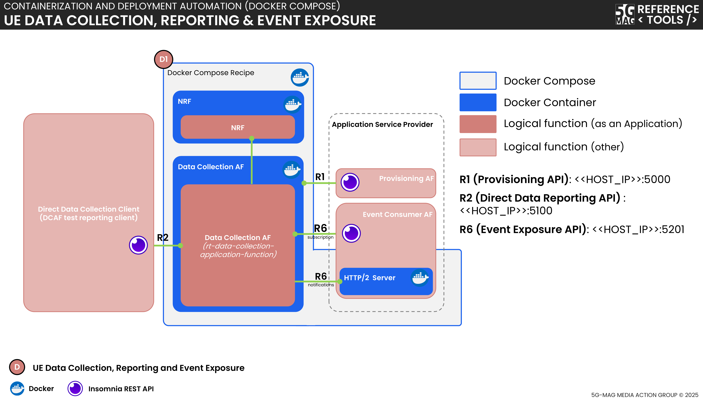

 

[Scope](../scope.html){: .btn .btn-blue } [Project Roadmap](../projects.html){: .btn .btn-blue } [GitHub Repos](../repositories.html){: .btn .btn-github } [Releases](../../releases.html#project-ue-data-collection-reporting--event-exposure){: .btn .btn-release } [Tutorials](../tutorials.html){: .btn .btn-tutorial } [Requirements](../requirements.html){: .btn .btn-blue }

# Tutorial - Docker Setup with Insomnia REST client

{: .inshort } This tutorial allows to: Setup the Data Collection Application Function with Docker and use its REST API with the Insomnia REST client.

<iframe width="560" height="315" src="https://www.youtube.com/embed/ZpktgeRCqNY?si=TMghwBOUmjV4MZkv" title="YouTube video player" frameborder="0" allow="accelerometer; autoplay; clipboard-write; encrypted-media; gyroscope; picture-in-picture; web-share" referrerpolicy="strict-origin-when-cross-origin" allowfullscreen></iframe>

# Setup diagram



# Requirements

To follow this tutorial you need to have Docker installed on your machine. You can download Docker
from [here](https://www.docker.com/products/docker-desktop). In addition, you will need the Insomnia REST client that
can be downloaded from [here](https://insomnia.rest/).

# DCAF Setup

## Downloading

First we need to clone the repository of the Data Collection Application Function. Open a terminal and
run:

```bash
git clone --recurse-submodules https://github.com/5G-MAG/rt-data-collection-application-function.git
```

## Starting the Docker Containers

Now that we have the source code of the Data Collection Application Function, we can build the Docker
images and start the Docker containers. For that reason, we navigate to the root directory of the repository and build
the Docker containers:

```bash
cd rt-data-collection-application-function/docker/local
docker compose up
```

This will start three Docker containers:

* `nrf`: A 5G Core NRF Network Function for the Application Function to register with.
* `dcaf`: The Data Collection Application Function that exposes multiple REST APIs to interact with. We will use these
  APIs later with the Insomnia REST client.
* `h2-server`: A fully-functional HTTP/2 server to handle data that is provided by the DCAF as a response to event.
  subscriptions.

Building the Docker containers may take a while. Once the containers are up and running, we can access the REST APIs
exposed by the Data Collection Application Function. For that reason, the ports of the `dcaf` container are mapped to
the corresponding ports on the host machine:

```yml
    dcaf:
        ports:
            - "5000:5000" # Provisioning API (R1)
            - "5100:5100" # Direct Data Reporting API (R2)
            - "5201:5201" # Event Consumer Application Function Event Exposure API (R6)
```

If you run into any issues with ports already being in use, you can change the port mappings in the
`docker-compose.yml`. Note that you also need to change the corresponding Insomnia environment variables then (see
Insomnia Setup below).

Once the Docker containers are running you should see an output like this:

````text
 ✔ Network reftools_5g-mag_data-collection-af-local_default        Created                                                                                                                            0.0s 
 ✔ Container reftools_5g-mag_data-collection-af-local-nrf-1        Created                                                                                                                            0.0s 
 ✔ Container reftools_5g-mag_data-collection-af-local-h2-server-1  Created                                                                                                                            0.0s 
 ✔ Container reftools_5g-mag_data-collection-af-local-dcaf-1       Created                                                                                                                            0.0s 
Attaching to dcaf-1, h2-server-1, nrf-1
nrf-1        | Open5GS daemon v2.7.2
nrf-1        | 
nrf-1        | 03/25 13:09:37.843: [app] INFO: Configuration: '/etc/open5gs/default/nrf.yaml' (../lib/app/ogs-init.c:133)
nrf-1        | 03/25 13:09:37.843: [app] INFO: File Logging: '/open5gs/install/var/log/open5gs/nrf.log' (../lib/app/ogs-init.c:136)
nrf-1        | 03/25 13:09:37.845: [sbi] INFO: nghttp2_server() [http://0.0.0.0]:7777 (../lib/sbi/nghttp2-server.c:424)
nrf-1        | 03/25 13:09:37.845: [app] INFO: NRF initialize...done (../src/nrf/app.c:31)
dcaf-1       | Open5GS daemon v2.6.4-10-gb9dd812
dcaf-1       | 
dcaf-1       | 03/25 13:09:37.972: [app] INFO: Configuration: '/etc/open5gs/dcaf.yaml' (../subprojects/open5gs/lib/app/ogs-init.c:126)
dcaf-1       | 03/25 13:09:37.972: [app] INFO: File Logging: '/home/ubuntu/af/open5gs/build/log/data-collection.log' (../subprojects/open5gs/lib/app/ogs-init.c:129)
dcaf-1       | 03/25 13:09:37.974: [app] INFO: LOG-LEVEL: 'info' (../subprojects/open5gs/lib/app/ogs-init.c:132)
dcaf-1       | 03/25 13:09:37.977: [DCAF] INFO: Initialising library: 
dcaf-1       |   Library Version: [libspdc-1.0.0] 
dcaf-1       |   Version [1.0.0] 
dcaf-1       |   Major: [0], 
dcaf-1       |   Minor [1] 
dcaf-1       |   Micro: [0]
dcaf-1       |  (../src/data-collection-af/init.c:105)
dcaf-1       | 03/25 13:09:37.979: [data-collection-service-producer] INFO: Registering Data Collection Service [3gpp-ndcaf_data-reporting-provisioning] (../lib/data-collection-service-provider/data-collection-nf-service.c:67)
dcaf-1       | 03/25 13:09:37.980: [data-collection-service-producer] INFO: Registering Data Collection Service [3gpp-ndcaf_data-reporting] (../lib/data-collection-service-provider/data-collection-nf-service.c:67)
dcaf-1       | 03/25 13:09:37.980: [data-collection-service-producer] INFO: Registering Data Collection Service [naf-eventexposure] (../lib/data-collection-service-provider/data-collection-nf-service.c:67)
dcaf-1       | 03/25 13:09:37.981: [sbi] INFO: nghttp2_server() [http://127.0.0.1]:7777 (../subprojects/open5gs/lib/sbi/nghttp2-server.c:395)
dcaf-1       | 03/25 13:09:37.982: [sbi] INFO: nghttp2_server() [http://0.0.0.0]:5000 (../subprojects/open5gs/lib/sbi/nghttp2-server.c:395)
dcaf-1       | 03/25 13:09:37.982: [sbi] INFO: nghttp2_server() [http://0.0.0.0]:5102 (../subprojects/open5gs/lib/sbi/nghttp2-server.c:395)
dcaf-1       | 03/25 13:09:37.982: [sbi] INFO: nghttp2_server() [http://0.0.0.0]:5100 (../subprojects/open5gs/lib/sbi/nghttp2-server.c:395)
nrf-1        | 03/25 13:09:37.986: [sbi] INFO: NF EndPoint(fqdn) setup [dcaf:0] (../lib/sbi/context.c:2195)
dcaf-1       | 03/25 13:09:37.983: [sbi] INFO: nghttp2_server() [http://0.0.0.0]:5101 (../subprojects/open5gs/lib/sbi/nghttp2-server.c:395)
nrf-1        | 03/25 13:09:37.986: [sbi] INFO: NF EndPoint(addr) setup [127.0.0.1:80] (../lib/sbi/context.c:2195)
dcaf-1       | 03/25 13:09:37.983: [sbi] INFO: nghttp2_server() [http://0.0.0.0]:5201 (../subprojects/open5gs/lib/sbi/nghttp2-server.c:395)
nrf-1        | 03/25 13:09:37.986: [sbi] INFO: NF EndPoint(addr) setup [0.0.0.0:5000] (../lib/sbi/context.c:1934)
dcaf-1       | 03/25 13:09:37.984: [sbi] INFO: nghttp2_server() [http://0.0.0.0]:5200 (../subprojects/open5gs/lib/sbi/nghttp2-server.c:395)
nrf-1        | 03/25 13:09:37.986: [sbi] INFO: NF EndPoint(addr) setup [0.0.0.0:5100] (../lib/sbi/context.c:1934)
dcaf-1       | 03/25 13:09:37.985: [app] INFO: 5G Data Collection AF initialize...done (../src/data-collection-af/app.c:23)
nrf-1        | 03/25 13:09:37.987: [sbi] INFO: NF EndPoint(addr) setup [0.0.0.0:5201] (../lib/sbi/context.c:1934)
dcaf-1       | 03/25 13:09:37.985: [DCAF] INFO: [67bfc656-097a-41f0-9047-3b8b76ef7fa1] DCAF Running (../src/data-collection-af/dcaf-sm.c:61)
nrf-1        | 03/25 13:09:37.987: [nrf] INFO: [67bfc656-097a-41f0-9047-3b8b76ef7fa1] NF registered [Heartbeat:10s] (../src/nrf/nf-sm.c:202)
dcaf-1       | 03/25 13:09:37.987: [sbi] INFO: [67bfc656-097a-41f0-9047-3b8b76ef7fa1] NF registered [Heartbeat:10s] (../subprojects/open5gs/lib/sbi/nf-sm.c:214)
````

# Insomnia Setup

Now that the Docker containers are up and running, we need to setup the Insomnia REST client.

## Pre-Configuration

The DCAF requires the HTTP version to be set to `HTTP/2 PriorKnowledge` for incoming requests. To set this up in
Insomnia, navigate to `Settings` and change `Preferred HTTP version` to `HTTP/2 PriorKnowledge`.

## Importing the Workspace

For your convenience, we have prepared an Insomnia workspace that you can import. You can download the workspace
from [here](https://github.com/5G-MAG/rt-data-collection-application-function/blob/development/usage/insomnia/Insomnia_DCAF.yaml).

Once you downloaded the file click on `import` in the Insomnia REST client and select the downloaded file. This will
import the required HTTP requests and the environment variables. You should then see the `5GMAG-DCAF` collection in the
center of the Insomnia window:


Now select the `5GMAG-DCAF` collection and you will see the available HTTP requests on the left side of Insomnia.


If you need to change the environment variables, you can do so by clicking on `5G-MAG DCAF` in the top left corner next
to the globe symbol and select the edit icon next to `Collection Environments`. Then you can edit the environment
variables.


Note that the Insomnia collection ships with multiple `After-Responses` scripts that set the environment
variables based on the payload or the headers of the HTTP response. As an example, the `provisioningSessionId` is
automatically set after creating a new Data Reporting Provisioning Session:

````js
const response = insomnia.response.json();
const provisioningSessionId = response.provisioningSessionId;
insomnia.environment.set("provisioning_session_id", provisioningSessionId);
````

# Using the REST APIs

Now that all components are running and our Insomnia workspace is setup, we can start using the REST APIs of the DCAF.
In this tutorial we will follow these steps:


## Start-Up phase

At start-up, the DCAF registers with the NRF and starts the HTTP/2 server. This is done automatically and does not
require any user interaction.

In the logs you will find the following lines:

```text
nrf-1        | 03/25 13:09:37.987: [nrf] INFO: [67bfc656-097a-41f0-9047-3b8b76ef7fa1] NF registered [Heartbeat:10s] (../src/nrf/nf-sm.c:202)
dcaf-1       | 03/25 13:09:37.987: [sbi] INFO: [67bfc656-097a-41f0-9047-3b8b76ef7fa1] NF registered [Heartbeat:10s] (../subprojects/open5gs/lib/sbi/nf-sm.c:214)
```

## Provisioning Phase

In the provisioning phase we act as an `Application Provider` and create a new Data Reporting Provisioning Session and a
Data Reporting Configuration. This is done by sending `POST` requests via Insomnia to the DCAF.

### Creating a new Data Reporting Provisioning Session

To create a new Data Reporting Provisioning Session navigate to the `R1 - Data Reporting Provisioning Session` folder in
the Insomnia workspace and select the
`Create a new Data Reporting Provisioning Session`.
Adjust the body of the request with the parameters you like to use or use the predefined ones. Then `Send` the request.

The DCAF returns the location of the created resource in the `location` header of the HTTP response. An `After-Response`
script will automatically save the provisioning session id in the corresponding environment variable:

````js
const response = insomnia.response.json();
const provisioningSessionId = response.provisioningSessionId;
insomnia.environment.set("provisioning_session_id", provisioningSessionId);
````

### Creating a new Data Reporting Configuration

Next we create a new Data Reporting Configuration. Navigate to the `R1 - Data Reporting Configuration` folder in the
Insomnia workspace and select the `Create a new Data Reporting Configuration` POST request. Send the request after
adjusting the body as desired.

Again, an `After-Response` script will automatically save the data reporting configuration id in the corresponding
environment variable:

````js
const response = insomnia.response.json();
const dataReportingConfigurationId = response.dataReportingConfigurationId;
insomnia.environment.set("data_reporting_configuration_id", dataReportingConfigurationId);
````

## Event Subscription Phase

In the event subscription phase we register for events that we are interested in. This is done by sending `POST`
requests as an Application Provider to the DCAF.

For that reason, navigate to the `R6 - Event Subscription` folder in the Insomnia workspace and select the
`Creates a new Individual Application Event Exposure Subscription resource` option.

Send the request after adjusting the remaining fields of the `body` as desired.

Again, an `After-Response` script will handle the response and save the event subscription id in the corresponding
environment variable if the response code is set to `200`:

````js
const locationHeader = insomnia.response.headers.find(header => header.key === 'location');

insomnia.test('Check if status is 200', () => {
    insomnia.expect(locationHeader).to.not.be.empty;
});

if (locationHeader) {
    const uuid = locationHeader.value.split('/').pop();
    if (uuid) {
        insomnia.environment.set('event_exposure_subscription_id', uuid);
    }
} 
````

### Optional: Changing the HTTP/2 server port

By default, the HTTP/2 server that is receiving the reports is started on port `8888`. If you want to change the port
open `h2_svr-docker.py` and edit the following line:

```python
server = await loop.create_server(H2Protocol, '0.0.0.0', 8888)
```

Replace `8888` with the port you want to use. For instance

```python
server = await loop.create_server(H2Protocol, '0.0.0.0', 4444)
```

As the port of the server that is receiving the event notifications is preconfigured we need to adjust the `notifUri` in the
request body. Copy the port number (in our example the port is set to `4444`) and replace the existing port in the
`notifUri` field of the request body. For instance:

````text
"notifUri": "http://h2-server:4444/dcaf/notification/handler",
````


## Data Reporting Phase

In the data reporting phase we take the role of the user equipment (UE) and create a data reporting session and then
send data reports.

### Creating a new Data Reporting Session

To create a new data reporting session navigate to the `R2 - Data Reporting Session` folder in the Insomnia workspace
and select `Create a new Data Reporting Session`. Send the request after adjusting the `body` parameters as desired.

Again, an `After-Response` script will handle the response and save the data reporting session id in the corresponding
environment variable:

```js
const response = insomnia.response.json();
const dataReportingSessionId = response.sessionId;
insomnia.environment.set("data_reporting_session_id", dataReportingSessionId);
```

### Submitting a communications report

The final step is to submit a communications report. For that reason, navigate to the `R2 - Data Reporting` folder and
select `Submit Communications Report`. Adjust the `body` parameters as desired and send the request.

### Checking the reports

If everything went well, you should see the reports in the log file located in
`rt-data-collection-application-function/docker/local/logs/notifications`. An example report looks like this:

````json
{
  "headers": {
    ":method": "POST",
    ":scheme": "http",
    ":authority": "h2-server:34117",
    ":path": "/dcaf/notification/handler",
    "accept": "*/*",
    "content-type": "application/json",
    "content-length": "340"
  },
  "body": {
    "notifId": "5g-mag-notification-id",
    "eventNotifs": [
      {
        "event": "UE_COMM",
        "timeStamp": "2025-03-25T13:00:44Z",
        "ueCommInfos": [
          {
            "appId": "5G-MAGAppID",
            "comms": [
              {
                "startTime": "2025-02-05T14:28:00Z",
                "endTime": "2025-02-05T14:29:00Z",
                "ulVol": 1000,
                "dlVol": 2000
              }
            ]
          }
        ]
      }
    ]
  }
}
````

### End Data Reporting Provisioning Session

In this tutorial we do not destroy the sessions so steps 18 - 21 from the above diagram are not executed. 
