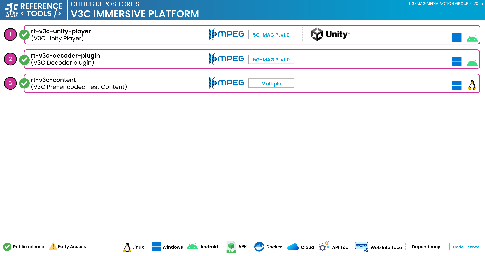

 

[Scope](./scope.html){: .btn .btn-blue } [Project Roadmap](./projects.html){: .btn .btn-blue } [GitHub Repos](./repositories.html){: .btn .btn-github } [Releases](./repositories.md#latest-releases){: .btn .btn-release } [Tutorials](./tutorials.html){: .btn .btn-tutorial } [Requirements](./requirements.html){: .btn .btn-blue }

# Repositories

The following repositories are available. Please refer to the "Scope & Architecture" sections of the different projects for more context.

---

## V3C Unity Player
[rt-v3c-unity-player](https://github.com/5G-MAG/rt-v3c-unity-player){: .btn .btn-v3c } [Releases](./repositories.md#latest-releases){: .btn .btn-release }

This project provides a Unity package to decode and play V3C contents in Unity, using the V3C Immersive Platform - Decoder Plugin. Also provided in that repository are V-PCC and MIV synthesizers plugins needed for the rendering of the V3C contents.

Additional information:
* [Information and how to download, build, install and run](https://github.com/5G-MAG/rt-v3c-unity-player#readme)
* [Releases](https://github.com/5G-MAG/rt-v3c-unity-player/releases)

## V3C Decoder Plugin
[rt-v3c-decoder-plugin](https://github.com/5G-MAG/rt-v3c-decoder-plugin){: .btn .btn-v3c } [Releases](./repositories.md#latest-releases){: .btn .btn-release }

This project contains the entrypoints for decoding and viewing MPEG Immersive Video (MIV) and Video Point Cloud Compression (V-PCC) related to the V3C Immersive Platform.

Additional information:
* [Information and how to download, build, install and run](https://github.com/5G-MAG/rt-v3c-decoder-plugin#readme)
* [Releases](https://github.com/5G-MAG/rt-v3c-decoder-plugin/releases)

## V3C Pre-encoded Test Content
[rt-v3c-content](https://github.com/5G-MAG/rt-v3c-content){: .btn .btn-v3c } [Releases](./repositories.md#latest-releases){: .btn .btn-release }

This folder contains the files to configure and test the V3CImmersivePlatform - Unity Player application.

Additional information:
* [Information and how to download, build, install and run](https://github.com/5G-MAG/rt-v3c-content#readme)
* [Releases](https://github.com/5G-MAG/rt-v3c-content/releases)

---

## Latest Releases

[Project Documentation](./v3c-immersive-platform/){: .btn .btn-blue }

<table class="release-table" style="width:100%; border-collapse: collapse; margin-top: 20px; table-layout: fixed;">
  <thead>
    <tr style="text-align: left; border-bottom: 2px solid #eee;">
      <th style="padding: 12px; width: 40%;">Repository</th>
      <th style="padding: 12px; width: 40%;">Version</th>
      <th style="padding: 12px; width: 20%;">Date</th>
    </tr>
  </thead>
  <tbody>
    
    <tr style="border-bottom: 1px solid #eee;">
      <td style="padding: 12px; overflow: hidden; text-overflow: ellipsis;"><a href="{{ item.url }}" class="btn">{{ item.short_name }}</a></td>
      <td style="padding: 12px; overflow: hidden; text-overflow: ellipsis;"><a href="{{ item.url }}" class="btn">{{ item.tag }}</a></td>
      <td style="padding: 12px;">{{ item.date }}</td>
    </tr>
    
  </tbody>
</table>
