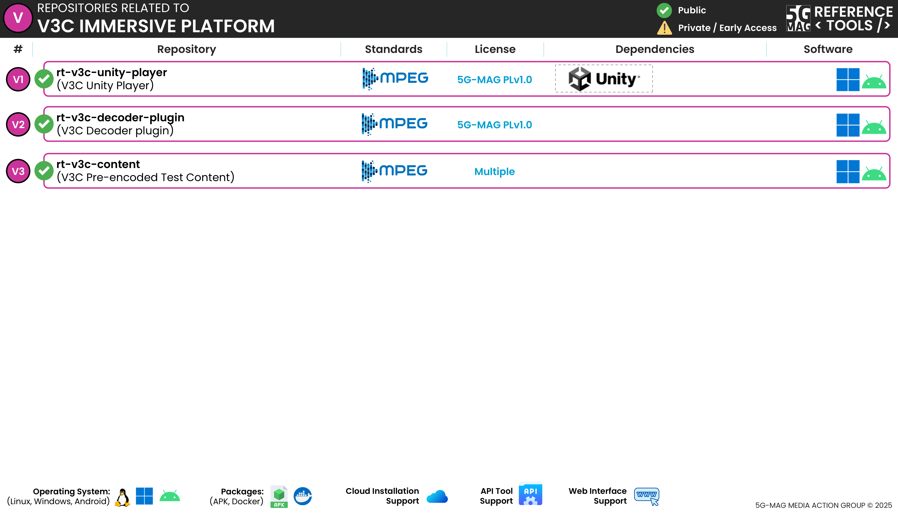

# Repositories

Note that these repositories are currently private and under testing. **Early access** can be requested at: [https://www.5g-mag.com/early-access](https://www.5g-mag.com/early-access)

## V3C Unity Player: [rt-v3c-unity-player](https://github.com/5G-MAG/rt-v3c-unity-player)
* [Information and how to download, build, install and run](https://github.com/5G-MAG/rt-v3c-unity-player#readme)
* [Releases](https://github.com/5G-MAG/rt-v3c-unity-player/releases)

## V3C Decoder Plugin: [rt-v3c-decoder-plugin](https://github.com/5G-MAG/rt-v3c-decoder-plugin)
* [Information and how to download, build, install and run](https://github.com/5G-MAG/rt-v3c-decoder-plugin#readme)
* [Releases](https://github.com/5G-MAG/rt-v3c-decoder-plugin/releases)
