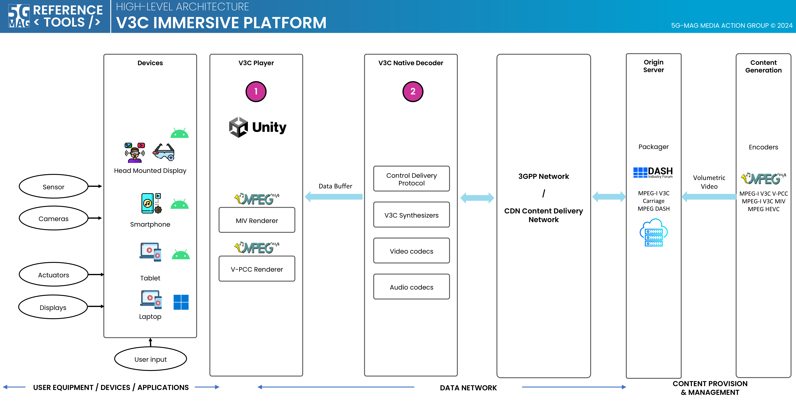

 

[Scope](./scope.html){: .btn .btn-blue } [Project Roadmap](./projects.html){: .btn .btn-blue } [GitHub Repos](./repositories.html){: .btn .btn-github } [Releases](./repositories.html#latest-releases){: .btn .btn-release } [Tutorials](./tutorials.html){: .btn .btn-tutorial } [Video Library](./tutorials.html#video-library){: .btn .btn-video } [Requirements](./requirements.html){: .btn .btn-blue }

# Scope

This page contains information such as the specifications within the scope of the tools and high-level architectures that bring context to their applicability.

Technical documentation providing context to this project can be found in the link below.

[Tech: Volumetric & Beyond 2D Video Experiences](https://hub.5g-mag.com/Tech/pages/volumetric.html){: .btn .btn-blue }

A list of relevant specifications can be found in the link below.

[Standards: Volumetric Video Experiences with MPEG V3C](https://hub.5g-mag.com/Standards/pages/volumetric-video.html){: .btn .btn-blue }

# High-level architectures

## V3C Immersive Platform

[V3C Immersive Platform: Repositories](../3gpp-ran-and-core-platforms/repositories.html){: .btn .btn-v3c }
[Common Tools: Repositories](../common-tools/){: .btn .btn-common }
