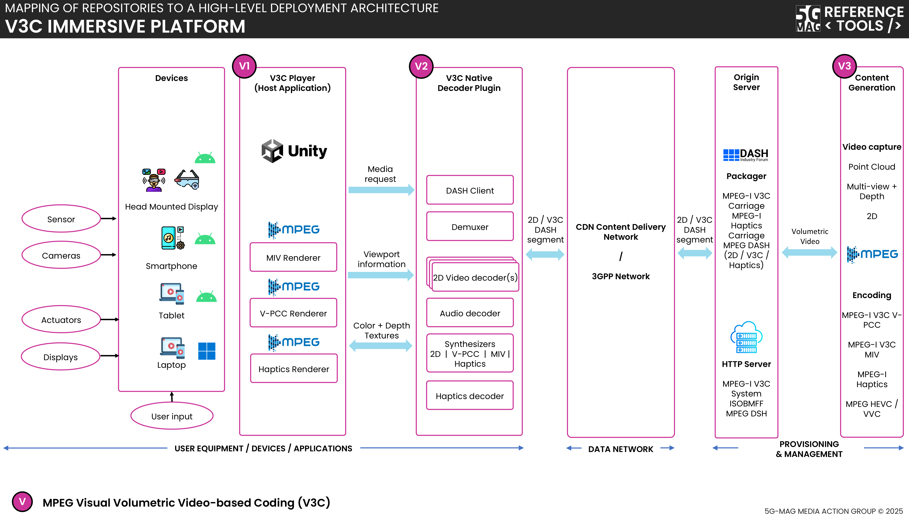

 

1. TOC
{:toc}

This page contains information such as the specifications within the scope of the tools, high-level architectures that bring context to their applicability, features under implementation,...

# Specifications
Visit the [Standards repository](https://5g-mag.github.io/Standards/pages/volumetric-video.html) for more details on the specifications within the scope of the tools.

# High-level architecture

## V3C Immersive Platform

 * Check [here](./repositories.html) to access the repositories for **V3C Immersive Platform**
 * Check [here](../common-tools/) to access the repositories for **Common Tools (Auxiliary tools common to various projects)**
