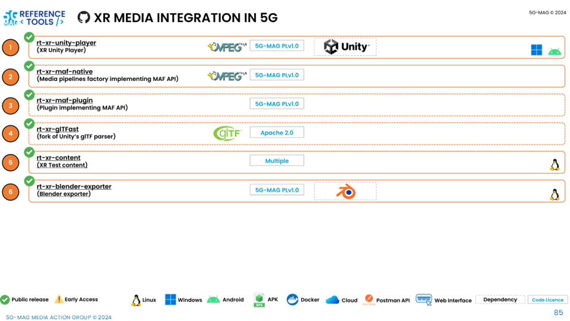

 

1. TOC
{:toc}

# High-level architecture

## XR Media Integration in 5G

# Repositories

---

## XR Player repositories

* [XR Player overview](https://5g-mag.github.io/Getting-Started/pages/xr-media-integration-in-5g/usage/xr-player-overview.html)

### XR Unity Player Unity project: [rt-xr-unity-player](https://github.com/5G-MAG/rt-xr-unity-player)
* [Information and how to download, build, install and run](https://github.com/5G-MAG/rt-xr-unity-player#readme)
* [Releases](https://github.com/5G-MAG/rt-xr-unity-player/releases)

### Fork of Unity's glTF package: [rt-xr-gITFast](https://github.com/5G-MAG/rt-xr-gITFast)
* [Information and how to download, build, install and run](https://github.com/5G-MAG/rt-xr-gITFast#readme)
* [Releases](https://github.com/5G-MAG/rt-xr-gITFast/releases)

### Media pipelines plugins implementing the Media Access Function (MAF) API: [rt-xr-maf-native](https://github.com/5G-MAG/rt-xr-maf-native)
* [Information and how to download, build, install and run](https://github.com/5G-MAG/rt-xr-maf-native#readme)
* [Releases](https://github.com/5G-MAG/rt-xr-maf-native/tags)

## Test content

## Content for the XR Unity Player: [rt-xr-content](https://github.com/5G-MAG/rt-xr-content)
* [Information](https://github.com/5G-MAG/rt-xr-content#readme)

## Blender Exporter: [rt-xr-blender-exporter](https://github.com/5G-MAG/rt-xr-blender-exporter)
* [Information and how to download, build, install and run](https://github.com/5G-MAG/rt-xr-blender-exporter#readme)
* [Releases](https://github.com/5G-MAG/rt-xr-blender-exporter/releases)

