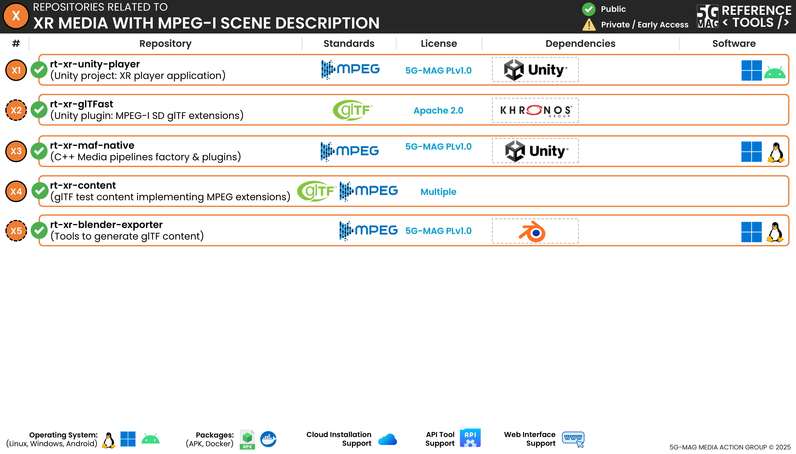

 

[Scope](./scope.html){: .btn .btn-blue } [Project Roadmap](./projects.html){: .btn .btn-blue } [GitHub Repos](./repositories.html){: .btn .btn-github } [Releases](../releases.htmll#project-xr-media-with-mpeg-i-scene-description){: .btn .btn-release } [Tutorials](./tutorials.html){: .btn .btn-tutorial } [Requirements](./requirements.html){: .btn .btn-blue }

# Repositories

The following repositories are available. Please refer to the "Scope & Architecture" sections of the different projects for more context.

---

## XR Unity Player Unity project
[rt-xr-unity-player](https://github.com/5G-MAG/rt-xr-unity-player){: .btn .btn-xr } [Releases](../releases.html#project-xr-media-with-mpeg-i-scene-description){: .btn .btn-release }

The XR Unity Player is an interactive and XR-capable glTF scene viewer implemented in Unity3D. It supports glTF extensions specified in the MPEG-I Scene Description framework (ISO/IEC 23090-14). 

Additional information:
* [Information and how to download, build, install and run](https://github.com/5G-MAG/rt-xr-unity-player#readme)
* [Releases](https://github.com/5G-MAG/rt-xr-unity-player/releases)

## Media pipelines plugins implementing the Media Access Function (MAF) API
[rt-xr-maf-native](https://github.com/5G-MAG/rt-xr-maf-native){: .btn .btn-xr } [Releases](../releases.html#project-xr-media-with-mpeg-i-scene-description){: .btn .btn-release }

This repository provides media pipelines implementations supporting the 5G-MAG Reference Tools XR Player Unity 3D project. Media pipelines are plugins for the XR Player's media player implementation of the Media Access Functions API (MAF) defined in ISO/IEC 23090-14.

Additional information:
* [Information and how to download, build, install and run](https://github.com/5G-MAG/rt-xr-maf-native#readme)
* [Releases](https://github.com/5G-MAG/rt-xr-maf-native/releases)

## Auxiliary repositories

### Fork of Unity's glTF package
[rt-xr-gITFast](https://github.com/5G-MAG/rt-xr-gITFast){: .btn .btn-xr } [Releases](../releases.html#project-xr-media-with-mpeg-i-scene-description){: .btn .btn-release }

This is a fork of Unity's glTF package which supports MPEG_* glTF extensions.

Additional information:
* [Information and how to download, build, install and run](https://github.com/5G-MAG/rt-xr-gITFast#readme)
* [Releases](https://github.com/5G-MAG/rt-xr-gITFast/releases)

### Content for the XR Unity Player
[rt-xr-content](https://github.com/5G-MAG/rt-xr-content){: .btn .btn-xr } [Releases](../releases.html#project-xr-media-with-mpeg-i-scene-description){: .btn .btn-release }

This repository provides reference content for testing and demos with the XR Player.

Additional information:
* [Information](https://github.com/5G-MAG/rt-xr-content#readme)

### Blender Exporter
[rt-xr-blender-exporter](https://github.com/5G-MAG/rt-xr-blender-exporter){: .btn .btn-xr } [Releases](../releases.html#project-xr-media-with-mpeg-i-scene-description){: .btn .btn-release }

This Blender add-on adds support for MPEG_* glTF extensions to the built-in glTF exporter.

Additional information:
* [Information and how to download, build, install and run](https://github.com/5G-MAG/rt-xr-blender-exporter#readme)
* [Releases](https://github.com/5G-MAG/rt-xr-blender-exporter/releases)

