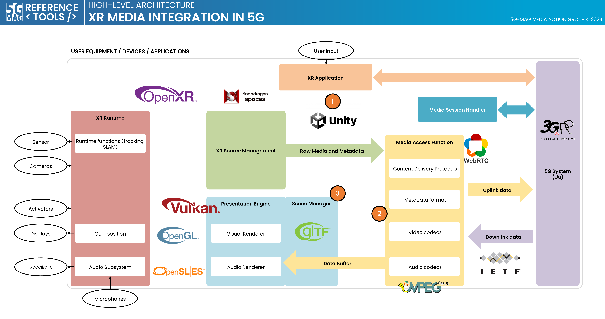
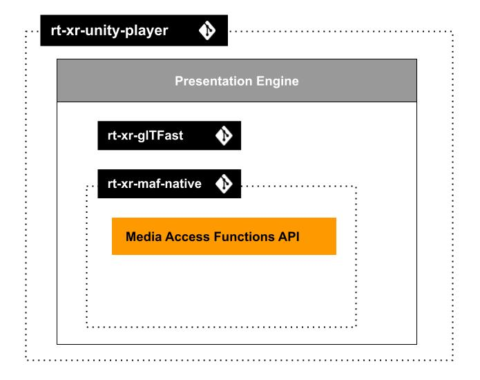
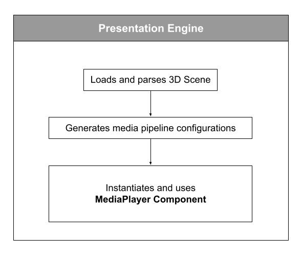
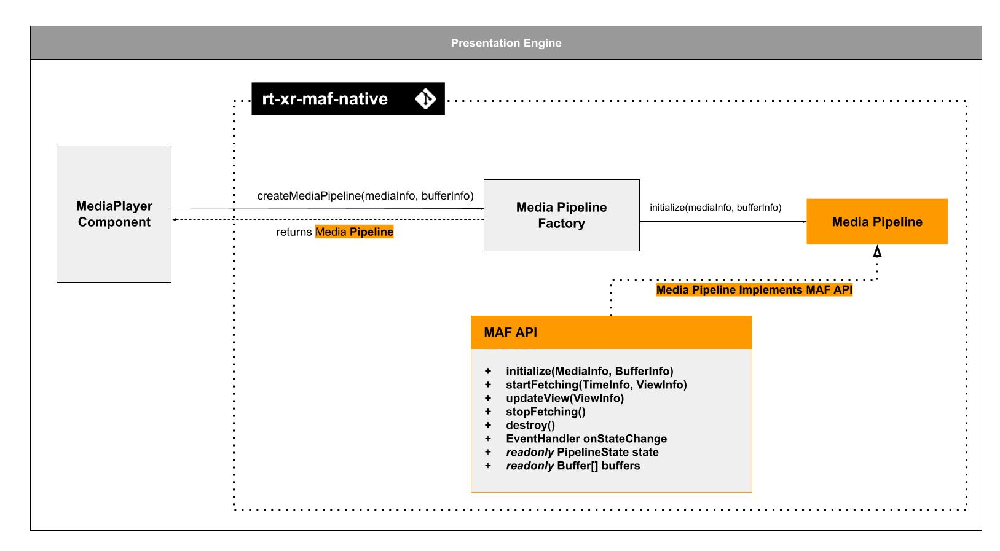

 

[Scope](./scope.html){: .btn .btn-blue } [Project Roadmap](./projects.html){: .btn .btn-blue } [GitHub Repos](./repositories.html){: .btn .btn-github } [Releases](../releases.htmll#project-xr-media-with-mpeg-i-scene-description){: .btn .btn-release } [Tutorials](./tutorials.html){: .btn .btn-tutorial } [Requirements](./requirements.html){: .btn .btn-blue }

# Scope

This page contains information such as the specifications within the scope of the tools, high-level architectures that bring context to their applicability, features under implementation,...

## Technical Resources and Specifications

[Technical Resources](https://hub.5g-mag.com/Tech/pages/xr.html){: .btn .btn-blue } [Specifications](https://hub.5g-mag.com/Standards/pages/xr.html){: .btn .btn-blue }

# Features 

The **MPEG-I Scene Description** reference architecture and features are described in the Technical Resources. This page describes those implemented in the 5G-MAG Reference Tools.

[Technical Resources](../../../Tech/pages/xr.html){: .btn .btn-blue }

Check below the:
* [**Features implemented in the XR Unity Player**](#features-implemented-in-the-xr-unity-player)
* [**Features implemented in the XR Unity Editor**](#mpeg-extensions-to-gltf-implemented-in-unity-player-and-unity-editor)

## Features implemented in the XR Unity Player

The XR Player takes 3D scenes in glTF format, supporting extensions that enable extended reality use cases. 
These extensions enable features such as XR anchoring, interactivity behaviors, and media pipelines.

- [View Changelog](https://github.com/5G-MAG/rt-xr-unity-player/releases)

### Media pipelines

Support for media sources (eg. mp4, dash, rtp,...) exposing media buffers to the presentation engine through the MPEG_media, MPEG_accessor_timer, MPEG_buffer_circular glTF extensions.

The media pipelines APIs are designed to fetch and decode timed media such as video textures, audio sources, geometry streams,...

| Reference scene       | XR Phone | XR HMD | Test content |
|:--------------------- |:-|:-|:-|
| Sample scene with media pipelines | &#x2611; | &#x2611; | [studio_apartment/studio_apartment.gltf](https://github.com/5G-MAG/rt-xr-content/tree/main/studio_apartment/studio_apartment.gltf)|

### Video texture

Supports video textures buffers through the MPEG_texture_video glTF video extension. Video decoding is implemented by media pipelines.

| Reference scene       | XR Phone | XR HMD | Test content |
|:--------------------- |:-|:-|:-|
| Sample scene with video texture | &#x2611; | &#x2611; | [studio_apartment/studio_apartment.gltf](https://github.com/5G-MAG/rt-xr-content/tree/main/studio_apartment/studio_apartment.gltf)|

### Spatial audio

Supports audio sources positionned in 3D through the MPEG_audio_spatial.

For each audio source the extension specifies attenuation parameters controling the audio source loudness as a function of the viewer's distance.

| Reference scene       | XR Phone | XR HMD | Test content |
|:--------------------- |:-|:-|:-|
| Sample scene with spatial audio source | &#x2611; | &#x2611; | [studio_apartment/studio_apartment.gltf](https://github.com/5G-MAG/rt-xr-content/tree/main/studio_apartment/studio_apartment.gltf)|

### Anchoring

The XR Player supports XR anchoring using the MPEG_anchor glTF extension which enables anchoring nodes and scenes to features (**Trackable**) tracked by the XR device. In augmented reality applications, anchored nodes are composited with the XR device's environment. 

The XR player leverages Unity's ARFoundation to support both handled mobile devices such as smartphones and head mounted devices (HMDs).

| Trackable type | XR Phone | XR HMD | Test content |
|:---------------|:---------|:-------------|:-------------|
| TRACKABLE_VIEWER | &#x2611; | &#x2611; | [anchoring/anchorTest_viewer_n.gltf](https://github.com/5G-MAG/rt-xr-content/tree/main/anchoring/) |
| TRACKABLE_FLOOR  | &#x2611; | &#x2610; | [awards/scene_floor_anchoring.gltf](https://github.com/5G-MAG/rt-xr-content/tree/main/awards/) |
| TRACKABLE_PLANE  | &#x2611; | &#x2611; | [awards/scene_plane_anchoring.gltf](https://github.com/5G-MAG/rt-xr-content/tree/main/awards/) |
| TRACKABLE_CONTROLLER | &#x2610; | &#x2611; | [anchoring/anchorTest_ctrl_n.gltf](https://github.com/5G-MAG/rt-xr-content/tree/main/anchoring/) |
| TRACKABLE_MARKER_2D | &#x2611; | &#x2610; | [anchoring/anchorTest_m2D_n.gltf](https://github.com/5G-MAG/rt-xr-content/tree/main/anchoring/) |
| TRACKABLE_MARKER_3D | &#x2610; | &#x2610; | [anchoring/anchorTest_m3D_n.gltf](https://github.com/5G-MAG/rt-xr-content/tree/main/anchoring/) |
| TRACKABLE_MARKER_GEO | &#x2611; | &#x2610; | [anchoring/anchorTest_geoSpatial_n_cs.gltf](https://github.com/5G-MAG/rt-xr-content/tree/main/anchoring/) |
| TRACKABLE_APPLICATION | &#x2611; | &#x2611; | [anchoring/anchorTest_app_n.gltf](https://github.com/5G-MAG/rt-xr-content/tree/main/anchoring/) |

### Interactivity

The XR Player supports specifying interactive **behaviors** in a 3D scene through the MPEG_scene_interactivity and MPEG_node_interactivity glTF extensions. 

An interactivity behavior combines one or more **triggers** that condition the execution of one or more **actions**.

The table below provide an overview of the supported triggers and actions:

| Trigger type | XR Phone | XR HMD | Test content |
|:----------------------|:-|:-|:-|
| TRIGGER_COLLISION     | &#x2611; | &#x2611; | [gravity/gravity.gltf](https://github.com/5G-MAG/rt-xr-content/tree/main/gravity)|
| TRIGGER_PROXIMITY      | &#x2611; | &#x2611; |[gravity/gravity.gltf](https://github.com/5G-MAG/rt-xr-content/tree/main/gravity), [geometry/UseCase_03-variant1-geometry.gltf](https://github.com/5G-MAG/rt-xr-content/tree/main/geometry)|
| TRIGGER_USER_INPUT     | &#x2611; | &#x2611; |[gravity/gravity.gltf](https://github.com/5G-MAG/rt-xr-content/tree/main/gravity), [geometry/UseCase_03-variant3-geometry.gltf](https://github.com/5G-MAG/rt-xr-content/tree/main/geometry)|
| TRIGGER_VISIBILITY    | &#x2611; | &#x2611; |[geometry/UseCase_03-variant3-geometry.gltf](https://github.com/5G-MAG/rt-xr-content/tree/main/geometry)|

| Action type           | XR Phone | XR HMD | Test content |
|:--------------------- |:-|:-|:-|
| ACTION_ACTIVATE       | &#x2611; | &#x2611; | [gravity/gravity.gltf](https://github.com/5G-MAG/rt-xr-content/tree/main/gravity)|
| ACTION_TRANSFORM      | &#x2611; | &#x2611; | [gravity/gravity.gltf](https://github.com/5G-MAG/rt-xr-content/tree/main/gravity)|
| ACTION_BLOCK          | &#x2611; | &#x2611; | [gravity/gravity.gltf](https://github.com/5G-MAG/rt-xr-content/tree/main/gravity)|
| ACTION_ANIMATION      | &#x2611; | &#x2611; | [geometry/UseCase_03-variant1-geometry.gltf](https://github.com/5G-MAG/rt-xr-content/tree/main/geometry)|
| ACTION_SET_MATERIAL   | &#x2611; | &#x2611; | [gravity/gravity.gltf](https://github.com/5G-MAG/rt-xr-content/tree/main/gravity)|
| ACTION_MANIPULATE     | &#x2610; | &#x2610; |  |
| ACTION_MEDIA          | &#x2610; | &#x2610; | 🚧 [issues/19](https://github.com/5G-MAG/rt-xr-unity-player/issues/19) |
| ACTION_HAPTIC         | &#x2610; | &#x2610; |  |
| ACTION_SET_AVATAR     | &#x2610; | &#x2610; | [issues/203](https://github.com/5G-MAG/Getting-Started/issues/203) |

## MPEG extensions to glTF implemented in Unity Player and Unity Editor

Note that "Unity player" refers to the compiled application, while "Unity editor" refers to the development environment which also allows running the app without actually compiling it for the target platform.

| glTF extension                                                                     | Unity player   | Unity editor v1.1.0 |
|:-----------------------------------------------------------------------------------|:---------------|:--------------------|
| MPEG_media                   | &#x2611;       | &#x2610;            |
| MPEG_buffer_circular         | &#x2611;       | &#x2610;            |
| MPEG_accessor_timed          | &#x2611;       | &#x2610;            |
| MPEG_audio_spatial           | &#x2611;       | &#x2610;            |
| MPEG_texture_video           | &#x2611;       | &#x2610;            |
| MPEG_scene_interactivity     | &#x2611;       | &#x2610;            |
| MPEG_node_interactivity      | &#x2611;       | &#x2610;            |
| MPEG_node_interactivity.type | &#x2611;       | &#x2610;            |
| MPEG_anchor                  | &#x2611;       | &#x2610;            |
| MPEG_sampler_YCbCr           | &#x2610;       | &#x2610;            |
| MPEG_primitive_V3C           | &#x2610;       | &#x2610;            |
| MPEG_avatar                  | &#x2610;       | &#x2610;            |
| MPEG_lights_texture_based    | &#x2610;       | &#x2610;            |
| MPEG_light_punctual          | &#x2610;       | &#x2610;            |
| MPEG_haptic                  | &#x2610;       | &#x2610;            |
| MPEG_mesh_linking            | &#x2610;       | &#x2610;            |
| MPEG_scene_dynamic           | &#x2610;       | &#x2610;            |
| MPEG_viewport_recommended    | &#x2610;       | &#x2610;            |
| MPEG_animation_timing        | &#x2610;       | &#x2610;            |

# High-level architectures

## XR Media Integration in 5G

[XR Media with MPEG-I SD: Repositories](../xr-media-integration-in-5g/repositories.html){: .btn .btn-xr }
[Common Tools: Repositories](../common-tools/){: .btn .btn-common }

# XR Unity Player: Project overview

## Scene description format

The Scene Description format standardized by [ISO/IEC JTC 1/SC29/WG03](https://www.iso.org/committee/45316.html) MPEG Systems in [ISO/IEC 23090-14](https://www.iso.org/standard/86439.html) specifies a framework enabling the composition of 3D scenes for immersive experiences, anchoring 3D assets in the real world, facilitating rich interactivity, supporting real-time media delivery.

It establishes interfaces like the Media Access Function (MAF) API to enable cross-platform interoperability, ensuring efficient retrieval and processing of media data, by decoupling the Presentation Engine from media pipeline.

## XR Player implementation

The XR Player is implemented as a Unity3D project: [rt-xr-unity-player](https://github.com/5G-MAG/rt-xr-unity-player).

The unity project builds on the following dependencies:
* [rt-xr-glTFast](https://github.com/5G-MAG/rt-xr-gITFast): parsing and instantiating of 3D scenes in Unity.
* [rt-xr-maf-native](https://github.com/5G-MAG/rt-xr-maf-native): a C++ Media Access Functions (MAF) API implementation, extensible with custom media pipeline plugins. 

### Test content

* [rt-xr-content](https://github.com/5G-MAG/rt-xr-content): test content implementing the scene description format.

See the [features page](../repositories/featuresXRplayer.md) for implementation status of the scene description format.

## MAF API & Media pipelines

The Media Access Functions (MAF) API is specified in ISO/IEC 23090-14:2023.

It's purpose is to decouple the presentation engine from media pipeline management, it allows the Presentation Engine to:
- pass View informations to the media pipelines (eg. to optimize fetching media )
- read media buffers updated by the media pipelines

The MAF API is protocol and codec agnostic, media can be fetched a remote URL.

### Media player implementation

#### MediaPlayer component 

The MediaPlayer component is part of the Presentation Engine layer:

The MediaPlayer component uses the MAF API implemented by Media Pipelines:

The XR Player uses a C++ implementation of the MAF API. It uses a factory / plugin pattern to allow development of media pipelines.

The mechanism by which a media pipeline is instantiated and buffers initialized, is out of the scope of ISO/IEC 23090-14.

For more on the MAF API implementation, review the [rt-xr-maf-native](https://github.com/5G-MAG/rt-xr-maf-native) repository.
