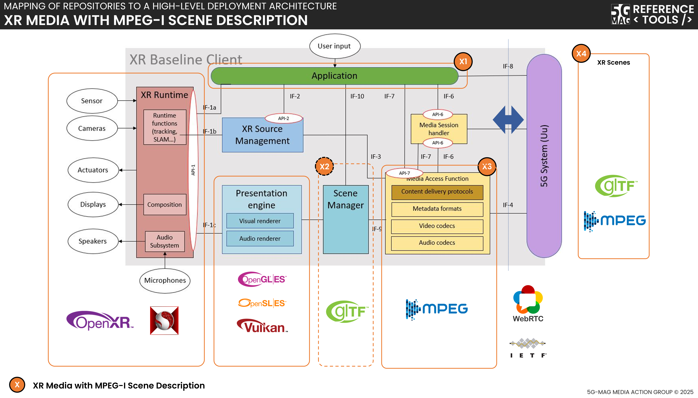

# Specifications and Architecture

## Specifications
Visit the [Standards repository](https://5g-mag.github.io/Standards/pages/xr.html) for details.

## High-level architecture

### High-level architecture: XR Media Integration in 5G

 * Check [here](.repositories.html) to access the repositories for XR Media Integration in 5G
