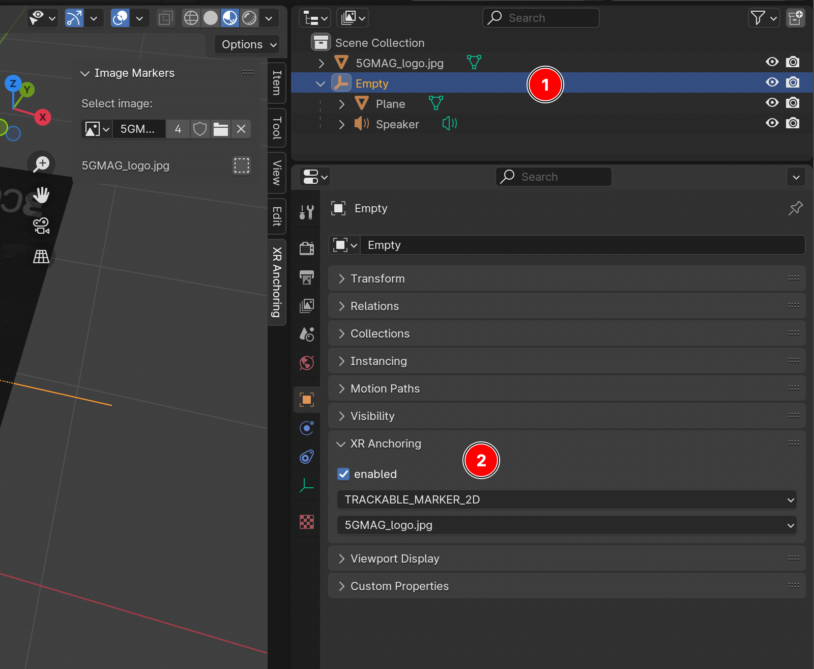
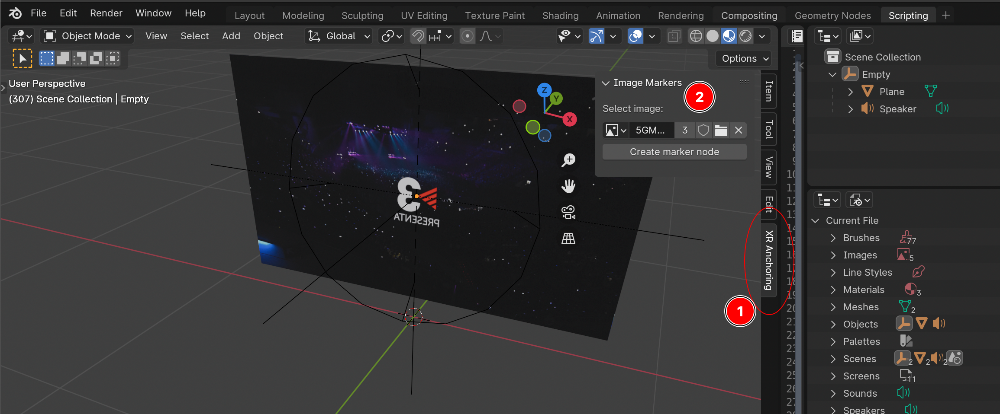
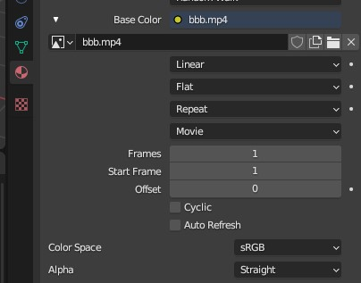
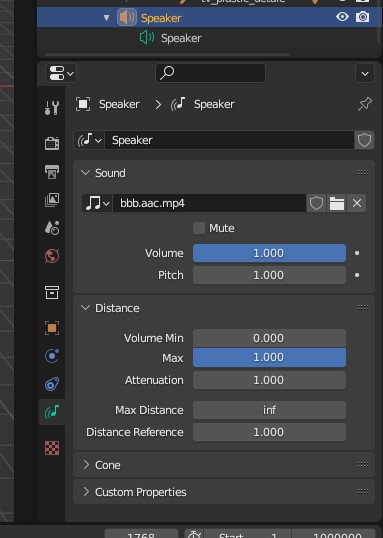
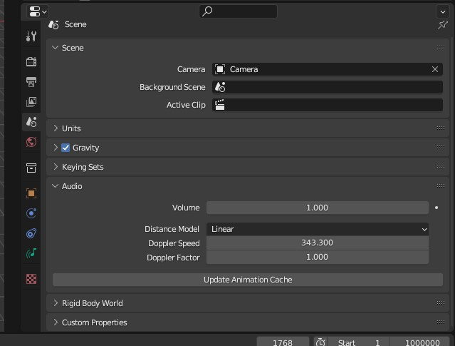

# MPEG-I Scene Description Test Asset Creation

1. TOC
{:toc}

## Content repositories

5G-MAG is hosting a repository with test assets implementing some of the core extensions defined in MPEG-I Scene Description (ISO/IEC 23090-14): [https://github.com/5G-MAG/rt-xr-content](https://github.com/5G-MAG/rt-xr-content).

Note the assets produced by the MPEG-I SD group are typically available for download at [https://standards.iso.org/iso-iec/23090/-24/](https://standards.iso.org/iso-iec/23090/-24/).
Khronos hosts sample glTF2.0 assets on GitHub: [https://github.com/KhronosGroup/glTF-Sample-Assets.git](https://github.com/KhronosGroup/glTF-Sample-Assets.git.).

## Blender add-on to generate MPEG-I SD compliant glTF2.0 assets

The 5G-MAG Reference Tools also provides a Blender add-on to support [MPEG_* glTF extensions](https://github.com/KhronosGroup/glTF/tree/main/extensions/2.0/Vendor) and export glTF files.

The repository is available here: [https://github.com/5G-MAG/rt-xr-blender-exporter](https://github.com/5G-MAG/rt-xr-blender-exporter)
A tutorial is available here: [Blender glTF Exporter and Unity Player](./blender_exporter_unity_player.html)

# List of available assets

## MPEG_anchor
The `MPEG_anchor` glTF extension enables anchoring nodes and scenes to features (*Trackable*) tracked by the XR device.

| Trackable type | Test content |
|:---------------|:-------|
| TRACKABLE_VIEWER | [anchoring/anchorTest_viewer_n.gltf](https://github.com/5G-MAG/rt-xr-content/tree/development/anchoring/) |
| TRACKABLE_FLOOR | [awards/scene_floor_anchoring.gltf](https://github.com/5G-MAG/rt-xr-content/tree/development/awards/) |
| TRACKABLE_PLANE | [awards/scene_plane_anchoring.gltf](https://github.com/5G-MAG/rt-xr-content/tree/development/awards/) |
| TRACKABLE_CONTROLLER | [anchoring/anchorTest_ctrl_n.gltf](https://github.com/5G-MAG/rt-xr-content/tree/development/anchoring/) |
| TRACKABLE_MARKER_2D | [anchoring/anchorTest_m2D_n.gltf](https://github.com/5G-MAG/rt-xr-content/tree/development/anchoring/) |
| TRACKABLE_MARKER_3D | [anchoring/anchorTest_m3D_n.gltf](https://github.com/5G-MAG/rt-xr-content/tree/development/anchoring/) |
| TRACKABLE_MARKER_GEO | [anchoring/anchorTest_geoSpatial_n_cs.gltf](https://github.com/5G-MAG/rt-xr-content/tree/development/anchoring/) |
| TRACKABLE_APPLICATION | [anchoring/anchorTest_app_n.gltf](https://github.com/5G-MAG/rt-xr-content/tree/development/anchoring/) |

## MPEG_scene_interactivity and MPEG_node_interactivity

**Behaviors** in a 3D scene can be defined through the `MPEG_scene_interactivity` and `MPEG_node_interactivity` glTF extensions. An interactivity behavior combines one or more **triggers** that condition the execution of one or more **actions**.

| Trigger type          | Test content |
|:----------------------|:-|
| TRIGGER_COLLISION     |[gravity/gravity.gltf](https://github.com/5G-MAG/rt-xr-content/tree/development/gravity)|
| TRIGGER_PROXIMITY     |[gravity/gravity.gltf](https://github.com/5G-MAG/rt-xr-content/tree/development/gravity), [geometry/UseCase_03-variant1-geometry.gltf](https://github.com/5G-MAG/rt-xr-content/tree/development/geometry)|
| TRIGGER_USER_INPUT    |[gravity/gravity.gltf](https://github.com/5G-MAG/rt-xr-content/tree/development/gravity), [geometry/UseCase_03-variant3-geometry.gltf](https://github.com/5G-MAG/rt-xr-content/tree/development/geometry)|
| TRIGGER_VISIBILITY    |[geometry/UseCase_03-variant3-geometry.gltf](https://github.com/5G-MAG/rt-xr-content/tree/development/geometry)|

| Action type           | Test content |
|:----------------------|:-|
| ACTION_ACTIVATE       |[gravity/gravity.gltf](https://github.com/5G-MAG/rt-xr-content/tree/development/gravity)|
| ACTION_TRANSFORM      |[gravity/gravity.gltf](https://github.com/5G-MAG/rt-xr-content/tree/development/gravity)|
| ACTION_BLOCK          |[gravity/gravity.gltf](https://github.com/5G-MAG/rt-xr-content/tree/development/gravity)|
| ACTION_ANIMATION      |[geometry/UseCase_03-variant1-geometry.gltf](https://github.com/5G-MAG/rt-xr-content/tree/development/geometry)|
| ACTION_SET_MATERIAL   |[gravity/gravity.gltf](https://github.com/5G-MAG/rt-xr-content/tree/development/gravity)|
| ACTION_MANIPULATE     | |
| ACTION_MEDIA          |[geometry/UseCase_02-variant3-geometry.gltf](https://github.com/5G-MAG/rt-xr-content/tree/development/geometry)|
| ACTION_HAPTIC         | |
| ACTION_SET_AVATAR     | |

### MPEG_media, MPEG_accessor_timer, MPEG_buffer_circular

Support for media sources (eg. mp4, dash, rtp, ...) exposing media buffers to the presentation engine through the `MPEG_media`, `MPEG_accessor_timer`, `MPEG_buffer_circular` glTF extensions. 

[Sample scene with media pipelines](https://github.com/5G-MAG/rt-xr-content/tree/development/studio_apartment)

### MPEG_texture_video

Supports video textures buffers through the `MPEG_texture_video` glTF video extension. Video decoding is implemented by media pipelines.

[Sample scene with video texture](https://github.com/5G-MAG/rt-xr-content/tree/development/studio_apartment)

### MPEG_audio_spatial

Supports audio sources positionned in 3D through the `MPEG_audio_spatial`. For each audio source the extension specifies attenuation parameters controling the audio source loudness as a function of the viewer's distance.

[Sample scene with spatial audio source](https://github.com/5G-MAG/rt-xr-content/tree/development/studio_apartment)

# Generation of MPEG-I SD compliant glTF2.0 assets

## MPEG_anchor

### Configure anchoring of a node

1. select the node to be anchored
2. locate the XR Anchoring panel in object properties, select an anchor type and configure the anchor

The following anchor types can be configured:
- TRACKABLE_FLOOR
- TRACKABLE_VIEWER
- TRACKABLE_CONTROLLER
- TRACKABLE_PLANE
- TRACKABLE_MARKER_2D
- TRACKABLE_MARKER_GEO
- TRACKABLE_APPLICATION

### Creating a 2D marker node

1. locate the XR Anchoring panel (press N while the UI is focused on the 3D view)
2. select an image and hit 'create marker node', the marker 2D node is added to the scene and can now be used to configure an anchor

## MPEG_texture_video

To add a video and export it as MPEG_texture_video, first make sure that the blender's [scene output format](https://docs.blender.org/manual/en/3.6/render/output/properties/format.html) matches the framerate of the videos used as texture.

1. Create or select a material
2. Select the shader slot which will be using the video, and make it an 'Image texture'
3. Open or Select the video to use

All Image textures with a movie source are exported as MPEG_texture_video extensions:

## MPEG_audio_spatial

### Audio sources 

To add an audio source to the scene:

1. Add a *[Speaker](https://docs.blender.org/manual/en/latest/render/output/audio/speaker.html)* node to the scene: *3D Viewport > Add > Speaker*
2. Add a file source to the speaker's *Sound*. The file is assumed to contain a single channel of audio (MONO).
3. Configure speaker's *Distance* parameters:
    - Max Distance
    - Attenuation (roll-off factor)
    - Distance Reference
All other parameters are ignored.

The **audio attenuation model** is configured as [a scene property](https://docs.blender.org/manual/en/latest/scene_layout/scene/properties.html#data-scenes-audio) in Blender.

