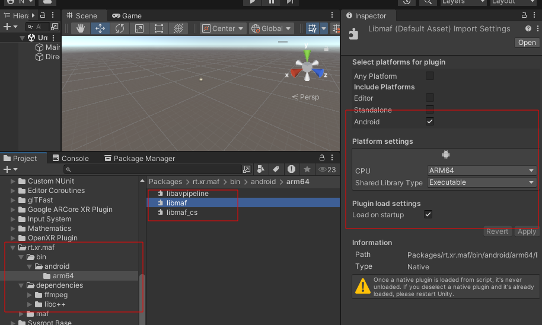

# Building and using XR Player on Android

This guide covers compiling the XR player sample Unity project for Android and configuring it with specific glTF content.

This section assumes [adb](https://developer.android.com/tools/adb) is installed on the machine, and an Android device with [developer options and USB debugging](https://developer.android.com/studio/debug/dev-options#enable) enabled is connected.

The project requires Unity 3D 2022.3 with both Android and iOS support modules installed.

While this guide assumes a Windows environment with a git-bash terminal (eg. to run shell scripts), the same instructions apply to other platoforms.

The tutorial covers the following steps:

1. [Clone the XR Player unity project](#1-clone-the-xr-player-unity-project)
2. [Compile & install media pipeline library and plugins for Android](#2-build-and-install-media-pipelines)
3. [Build and run the unity project](#3-build-and-run-the-unity-project)
4. [Configure the XR player sample application](#4-configure-the-xr-player-sample-application)
5. [Launch the player](#5-launch-the-player)


## 1. Clone the XR Player unity project
```
git clone --recursive https://github.com/5G-MAG/rt-xr-unity-player.git
```

Note: --recursive is required to get all submodules checked out. 


## 2. Build and install media pipelines

### Clone and install the source code
```
git clone git@github.com:5G-MAG/rt-xr-maf-native.git
cd rt-xr-maf-native
```

### Compile libmaf and media pipeline plugins

#### compile and install dependencies

Follow [these instructions](https://github.com/5G-MAG/rt-common-shared/tree/main/avcodec-build) to compile the avpipeline dependencies.

Copy the generated libraries into the avpipeline subproject:
```
mkdir -p ./rt-xr-maf-native/subprojects/avpipeline/external/avcodec/android/arm64-v8a/lib
cp ./rt-common-shared/avcodec-build/build/ffmpeg/aarch64/lib/*.so ./rt-xr-maf-native/subprojects/avpipeline/external/avcodec/android/arm64-v8a/lib

mkdir -p ./rt-xr-maf-native/subprojects/avpipeline/external/avcodec/android/arm64-v8a/include
cp ./rt-common-shared/avcodec-build/build/ffmpeg/aarch64/include/* ./rt-xr-maf-native/subprojects/avpipeline/external/avcodec/android/arm64-v8a/include

cp ./rt-common-shared/avcodec-build/build/ffmpeg/aarch64/LICENSE ./rt-xr-maf-native/subprojects/avpipeline/external/avcodec/android/arm64-v8a/LICENSE
```

#### configure cross compilation configuration 

* Download and install the Android NDK. In the next steps, we assume a Windows x86_64 environment with the Android NDK *28.0.12674087* installed in `C:\Users\fivegmag\AppData\Local\Android\Sdk\ndk`.
* Locate the `./rt-xr-maf-native/crossfile/android-arm64-v8a` and modify it to point to your local NDK installation, for instance: 
```
[binaries]
ar = ['C:\Users\fivegmag\AppData\Local\Android\Sdk\ndk\28.0.12674087\toolchains\llvm\prebuilt\windows-x86_64\bin\llvm-ar']
c = ['C:\Users\fivegmag\AppData\Local\Android\Sdk\ndk\28.0.12674087\toolchains\llvm\prebuilt\windows-x86_64\bin\aarch64-linux-android28-clang.cmd']
cpp = ['C:\Users\fivegmag\AppData\Local\Android\Sdk\ndk\28.0.12674087\toolchains\llvm\prebuilt\windows-x86_64\bin\aarch64-linux-android28-clang++.cmd']
c_ld = ['C:\Users\fivegmag\AppData\Local\Android\Sdk\ndk\28.0.12674087\toolchains\llvm\prebuilt\windows-x86_64\bin\ld.lld']
cpp_ld = ['C:\Users\fivegmag\AppData\Local\Android\Sdk\ndk\28.0.12674087\toolchains\llvm\prebuilt\windows-x86_64\bin\ld.lld']
strip = ['C:\Users\fivegmag\AppData\Local\Android\Sdk\ndk\28.0.12674087\toolchains\llvm\prebuilt\windows-x86_64\bin\llvm-strip']
```


#### configure and compile the MAF library and media pipeline plugins

* `libmaf` and C# bindings are enabled by default. 
* the `avpipeline` plugin needs explicit configuration, the `avcodec_dir` must point to a subdirectory of the project where platfomrm specfic dependencies have been copied:

```
cd rt-xr-maf-native
meson setup --wipe -Davpipeline=true -Davpipeline:avcodec_dir=external/avcodec/android/arm64-v8a build/android/arm64-v8a --cross-file crossfile/android-arm64-v8a
meson compile -C build/android/arm64-v8a
```

### install the media pipeline factory and plugins into the Unity project

Assuming *rt-xr-unity-player* repository has been cloned in a sibling directory `../rt-xr-unity-player`:
```
export ANDROID_NDK_HOME='/c/Users/fivegmag/AppData/Local/Android/Sdk/ndk/28.0.12674087'
cd rt-xr-maf-native
scripts/install_android.sh ../rt-xr-unity-player/Packages/rt.xr.maf
```

the script copies the following:
* all *compiled libraries* from `rt-xr-maf-native/build/android/arm64-v8a/` to `rt-xr-unity-player/Packages/rt.xr.maf/bin/android/arm64/`
* *C# bindings* source code from `rt-xr-maf-native/subprojects/maf_csharp/swig/` to `rt-xr-unity-player/Packages/rt.xr.maf/maf/swig/`
* *avpipeline* dependencies from `rt-xr-maf-native/subprojects/avpipeline/external/avcodec/android/arm64-v8a/lib/` to `rt-xr-unity-player/Packages/rt.xr.maf/dependencies/ffmpeg/7.1/android/arm64` along with the related LICENSE
* *libc++* from `$ANDROID_NDK_HOME/toolchains/llvm/prebuilt/$ANDROID_NDK_HOSTNAME/sysroot/usr/lib/aarch64-linux-android/libc++_shared.so` to `rt-xr-unity-player/Packages/rt.xr.maf/dependencies/libc++/android/arm64`

Make sure all the *.so libraries are configured properly in the Unity editor. For each library, in the inspector panel:


* *Android* platform must be checked
* *arm64* must be selected


The configuration is stored in Unity's *.meta sidecar files and are tracked in the Unity repository. Unity removes the *.meta files if the ressource they reference are not found when opening a project.  


## 3. Build and run the unity project

Open the `rt-xr-unity-player` directory as an existing project from Unity Hub. Then in the Unity Editor:


1. Locate the `File > Build Settings` menu 
2. Make sure that Android is the selected platform, Switch Platform if needed
3. Ensure that `XRScene` is the default scene.
4. Select the device on which the application will be installed.
5. Hit `Build and Run` to compile the project and install it on the mobile device


## 4. Configure the XR player sample application

Clone the `rt-xr-content` repository. This **requires [git lfs](https://git-lfs.com/)** to be installed on your system.

```
git clone https://github.com/5G-MAG/rt-xr-content.git
```

Push glTF content to the phone:
```
cd rt-xr-content
adb push ./awards /storage/emulated/0/Android/data/com.fivegmag.rtxrplayer/files/awards
```

Create a file named *'Paths'* listing gltf documents to be exposed in the player, one per line:
```
/storage/emulated/0/Android/data/com.fivegmag.rtxrplayer/files/awards/awards.gltf
/storage/emulated/0/Android/data/com.fivegmag.rtxrplayer/files/awards/awards_floor_anchoring.gltf
```

Upload the *'Paths'* file to the Android device:
```
adb push ./Paths /storage/emulated/0/Android/data/com.fivegmag.rtxrplayer/files/Paths
```


## 5. Launch the player

Locate and launch the player. 
A menu to select scenes in the configured content will be listed by the player at startup.


