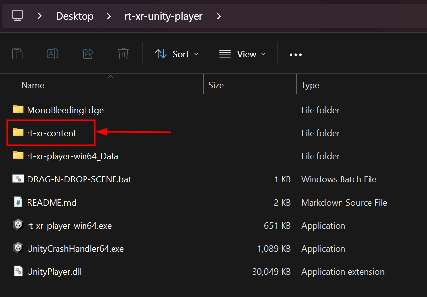
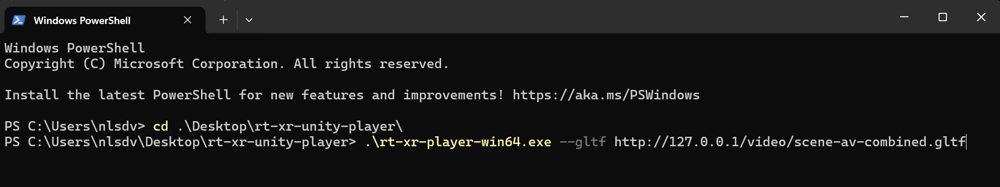
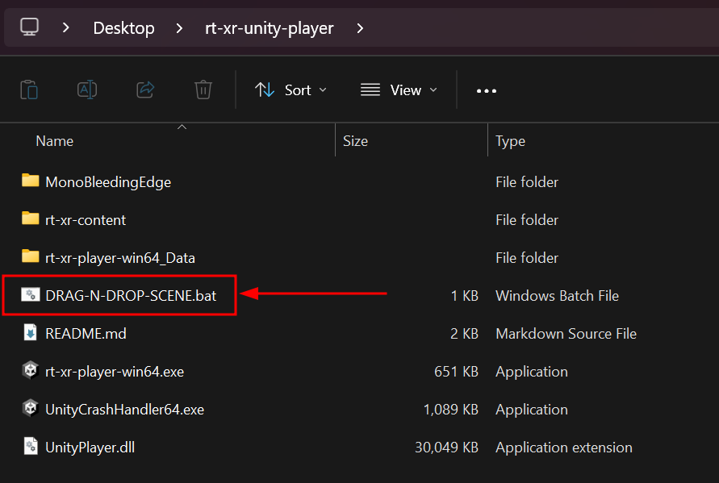

## Introduction
This tutorial covers usage of XR Player on Windows.

1. table of content
{:toc}

The XR Player Windows release supports rendering on an HMD by default if a supporting OpenXR runtime is available.
When no supporting OpenXR runtime is detected, the player runs in a regular desktop window. 

The Meta Quest HMDs connected to a PC through Meta Quest Link provide such OpenXR runtimes.

{: .highlight }
If you do not have a Meta Quest HMD, simply ignore the requirements and optional steps related to Meta Quest in this tutorial.

## Requirements

- Windows 11

In order to use the Meta Quest link:
{: .d-inline-block }
optional 
{: .label .label-yellow }

- a Meta Quest headset ( 2, 3 and Pro are confirmed to work)
- a machine compatible with the [Meta Quest link requirements](https://www.meta.com/en-gb/help/quest/articles/headsets-and-accessories/oculus-link/requirements-quest-link/)
- the [Oculus PC app for Meta Quest Link](https://www.meta.com/en-gb/help/quest/articles/headsets-and-accessories/oculus-rift-s/install-app-for-link/)


### Meta Quest Link support
{: .no_toc }
{: .d-inline-block }
optional 
{: .label .label-yellow }

- Follow the instructions on [Meta's support article](https://www.meta.com/en-gb/help/quest/articles/headsets-and-accessories/oculus-rift-s/install-app-for-link/). The step by step [developer tutorial](https://developer.oculus.com/documentation/unity/unity-link/) also provides some usefull screenshots if you aren't familiar with the Meta Quest platform - note that beta features aren't needed.
- Meta Quest Link supports a USB mode as well as a [WiFi](https://www.meta.com/en-gb/help/quest/articles/headsets-and-accessories/oculus-link/connect-with-air-link/) mode. 
- [Adjust graphics perfomance settings](https://www.meta.com/en-gb/help/quest/articles/headsets-and-accessories/oculus-link/link-performance-preferences/) depending on your computer's configuration.


## Getting Started

**1. Get the player**

Download the [latest release](https://github.com/5G-MAG/rt-xr-unity-player/tags) or [build](https://github.com/5G-MAG/rt-xr-unity-player?tab=readme-ov-file#build) the XR player.


**2. Get the test content**

[Download the latest test content](https://github.com/5G-MAG/rt-xr-content/archive/refs/heads/main.zip) from github's rt-xr-content repository.

**3. Locate the test content to the player directory**

By default the player expects the `rt-xr-content` directory to be located next to the executable so that double clicking on `rt-xr-player.exe` launches without further configuration.



**4.  [Start the Meta Quest Link Mode](#meta-quest-link-support) on the headset**
{: .d-inline-block }
optional 
{: .label .label-yellow }

**5. Launch the `rt-xr-player.exe` application**


### Command line usage

Launching custom scenes is normaly achieved from the command line, typically PowerShell on windows.
In that case the content can be located anywhere on the file system or downloaded over http:

#### Launch a scene available over http




### Using a custom launcher shortcut

If you downloaded an XR Player release, a drag and drop launcher is provided.

Such a launcher is just create a file with a `.bat` extension and the following content:
```
%~dp0rt-xr-player.exe --gltf "%1"
pause 
```

> "%1" means the dropped argument, and could be replaced by an URI.





### Keyboard / Mouse controls 

Refer to the github repository for the [up to date list of available keyboard and mouse controls](https://github.com/5G-MAG/rt-xr-unity-player?tab=readme-ov-file#usage).
