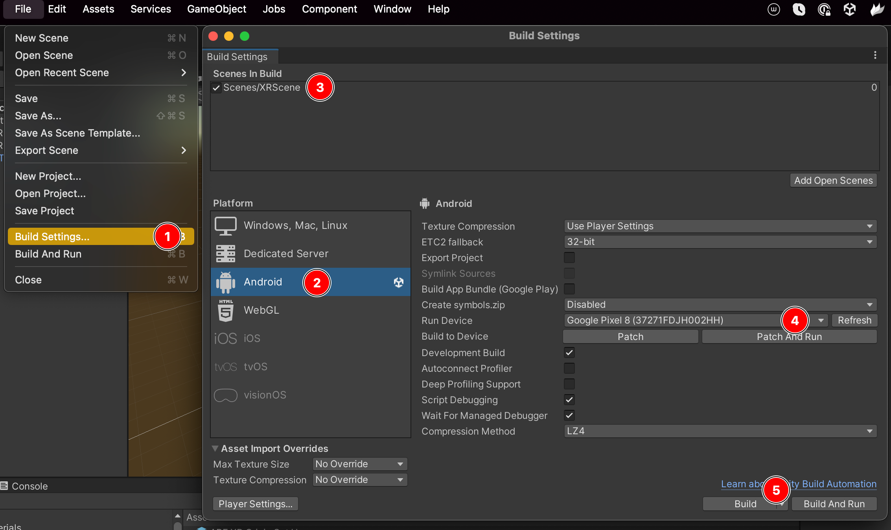
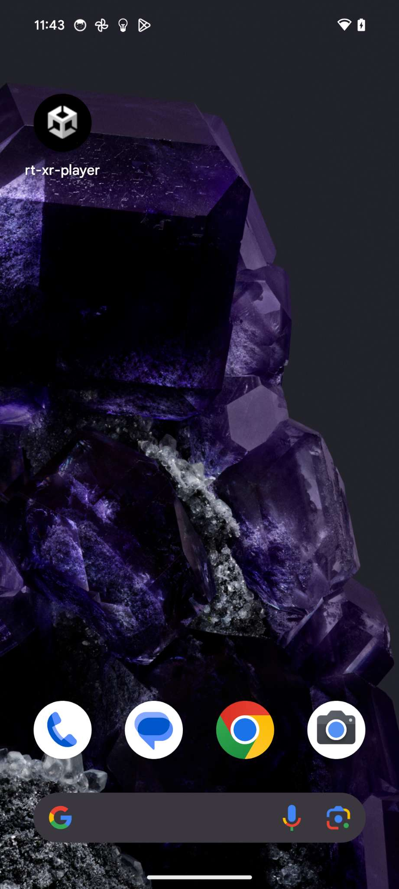
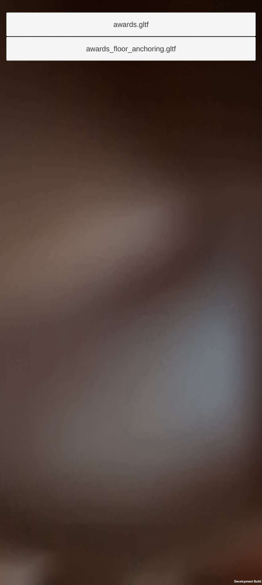

# Building and using XR Player on Android

This guide covers compiling the XR player Unity project for Android and configuring it with specific glTF content.

Mobile XR refers to augmented or mixed reality applications running on handheld devices such as smartphones. 

This section assumes [adb](https://developer.android.com/tools/adb) is installed on the machine, and an Android smartphone with [developer options and USB debugging](https://developer.android.com/studio/debug/dev-options#enable) enabled is connected.


## 1. Get the source code

Clone the code for the first time: 
```
git clone --recursive https://github.com/5G-MAG/rt-xr-unity-player.git
```

or pull latest changes: 
```
git pull --recurse-submodules
```


## 2. Build the project & install it on an Android device



1. Locate the `File > Build Settings` menu 
2. Make sure that Android is the selected platform, Switch Platform if needed
3. Ensure that `XRScene` is the default scene
4. Select the device on which the application will be installed
5. Hit `Build and Run` to compile the project and install it on the mobile device


## 3. Push content to an Android device & configure the player

Clone the `rt-xr-content` repository:
```
git clone https://github.com/5G-MAG/rt-xr-content.git
```

Push glTF content to the phone:
```
cd rt-xr-content
adb push ./awards /storage/emulated/0/Android/data/com.fivegmag.rtxrplayer/files/awards
```

Create a file named *'Paths'* listing gltf documents to be exposed in the player, one per line:
```
/storage/emulated/0/Android/data/com.fivegmag.rtxrplayer/files/awards/awards.gltf
/storage/emulated/0/Android/data/com.fivegmag.rtxrplayer/files/awards/awards_floor_anchoring.gltf
```

Upload the *'Paths'* file to the Android device:
```
adb push ./Paths /storage/emulated/0/Android/data/com.fivegmag.rtxrplayer/files/Paths
```


## 4. Launch the player

Locate and launch the player. 
A menu to select scenes in the configured content will be listed by the player at startup.




