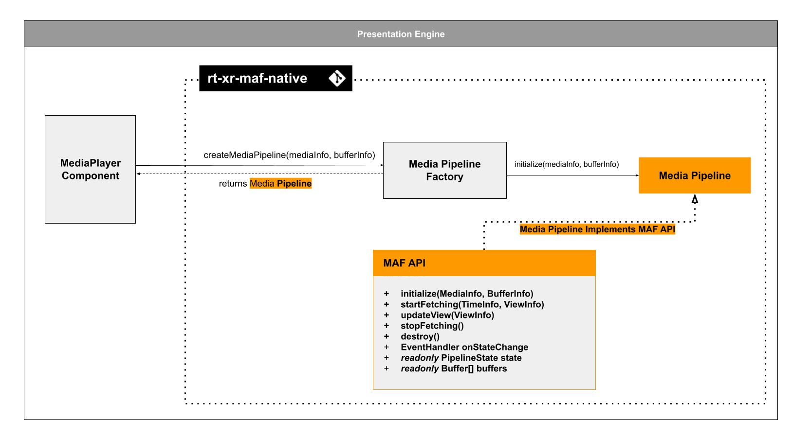

# XR Player : project overview

## Scene description format

The Scene Description format standardized by [ISO/IEC JTC 1/SC29/WG03](https://www.iso.org/committee/45316.html) MPEG Systems in [ISO/IEC 23090-14](https://www.iso.org/standard/86439.html) specifies a framework enabling the composition of 3D scenes for immersive experiences, anchoring 3D assets in the real world, facilitating rich interactivity, supporting real-time media delivery.

It establishes interfaces like the Media Access Function (MAF) API to enable cross-platform interoperability, ensuring efficient retrieval and processing of media data, by decoupling the Presentation Engine from media pipeline.

## XR Player implementation

 

The XR Player is implemented as a Unity3D project: [rt-xr-unity-player](https://github.com/5G-MAG/rt-xr-unity-player).

The unity project builds on the following dependencies:
* [rt-xr-glTFast](https://github.com/5G-MAG/rt-xr-gITFast): parsing and instantiating of 3D scenes in Unity.
* [rt-xr-maf-native](https://github.com/5G-MAG/rt-xr-maf-native): a C++ Media Access Functions (MAF) API implementation, extensible with custom media pipeline plugins. 

### Test content

* [rt-xr-content](https://github.com/5G-MAG/rt-xr-content): test content implementing the scene description format.

See the [features page](features) for implementation status of the scene description format.

## MAF API & Media pipelines

The Media Access Functions (MAF) API is specified in ISO/IEC 23090-14:2023.

It's purpose is to decouple the presentation engine from media pipeline management, it allows the Presentation Engine to:
- pass View informations to the media pipelines (eg. to optimize fetching media )
- read media buffers updated by the media pipelines

The MAF API is protocol and codec agnostic, media can be fetched a remote URL.

### Media player implementation

#### MediaPlayer component 

The MediaPlayer component is part of the Presentation Engine layer:

The MediaPlayer component uses the MAF API implemented by Media Pipelines:

The XR Player uses a C++ implementation of the MAF API. It uses a factory / plugin pattern to allow development of media pipelines.

The mechanism by which a media pipeline is instantiated and buffers initialized, is out of the scope of ISO/IEC 23090-14.

For more on the MAF API implementation, review the [rt-xr-maf-native](https://github.com/5G-MAG/rt-xr-maf-native) repository.
