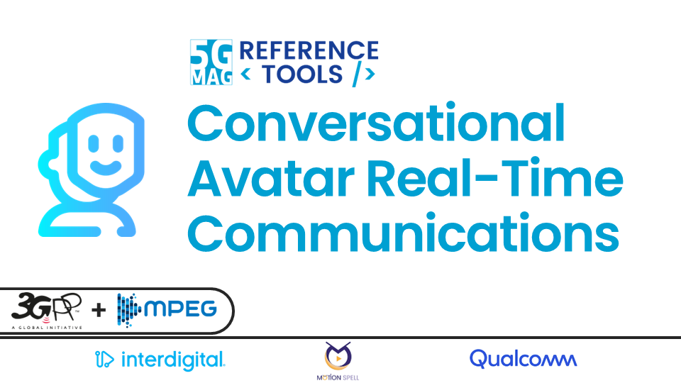

 

# eXtended Reality (XR): 3D Scenes and Avatar Communications

<table>
  <tr>
    <td markdown="span" align="center"><a href="./xr-media-integration-in-5g/"><a/></td>
    <td markdown="span" align="center"><a href="./avatar-communications/"><a/></td>
  </tr>
  <tr>
    <td markdown="span" align="center">[Project Documentation](./xr-media-integration-in-5g/){: .btn .btn-blue } [Project Roadmap](https://github.com/orgs/5G-MAG/projects/48/views/16){: .btn .btn-blue } [Latest Releases](./releases.html#project-xr-media-with-mpeg-i-scene-description){: .btn .btn-blue } </td>
    <td markdown="span" align="center">[Project Documentation](./avatar-communications/){: .btn .btn-blue } [Project Roadmap](https://github.com/orgs/5G-MAG/projects/48/views/xx){: .btn .btn-blue } [Latest Releases](./releases.html#project-avatar-communications){: .btn .btn-blue } </td>
  </tr>
</table>

---

## Other Tools

### Auxiliary tools common to various projects
[Documentation](./common-tools/index.html){: .btn .btn-blue }
[Latest Releases](./releases.html#auxiliary-tools-common-to-various-projects){: .btn .btn-blue }

### 3GPP RAN and Core Platforms
[Documentation](./3gpp-ran-and-core-platforms/index.html){: .btn .btn-blue }

### External Tools
[Documentation](./external-tools/index.html){: .btn .btn-blue }
